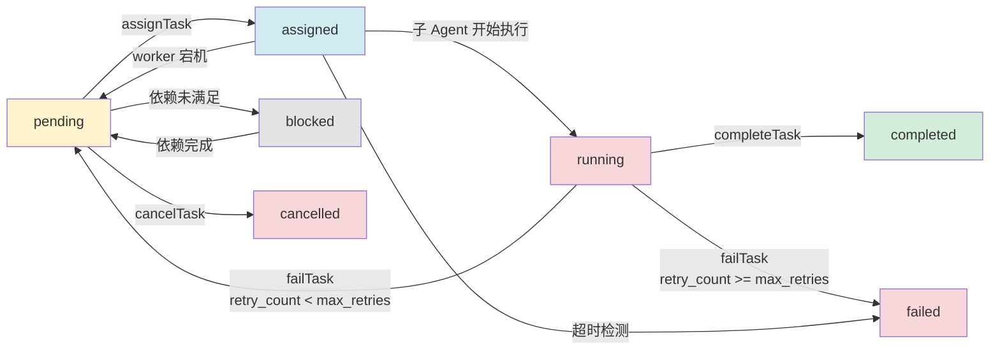
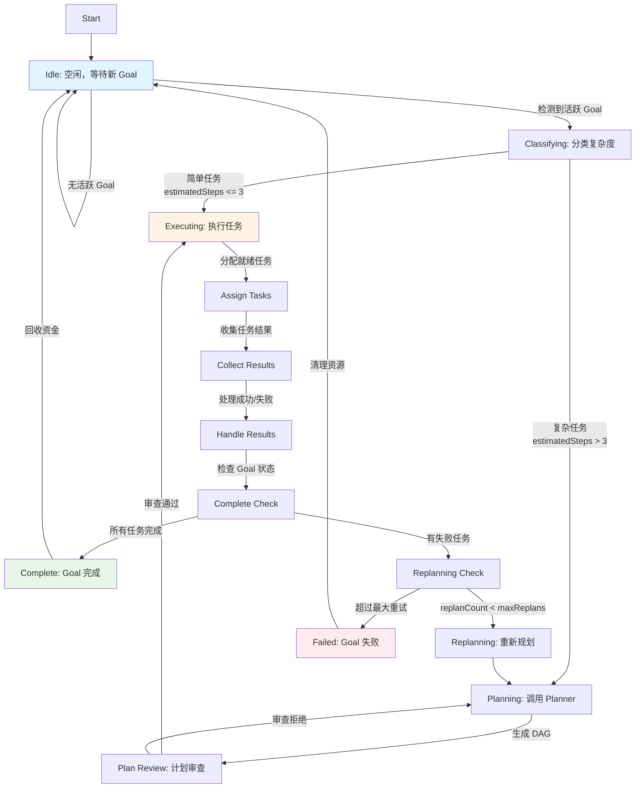

# 故事 1a+.2: 编排引擎与任务图

## 📋 故事标识
- **ID**: 1a+.2
- **标题**: 编排引擎与任务图
- **优先级**: 🔥🔥🔥 高
- **关联 Epic**: 1a+ (Upwork AutoPilot 自动投标系统)

## 🎯 用户故事

作为 Upwork AutoPilot 的 ArchitectAgent，我需要调用 Automaton 的编排引擎自动分解复杂项目为可执行的任务 DAG，以便将任务分配给合适的 DevAgent、QAAgent 等子 Agent 并行执行，最终在预算范围内按时交付代码。

**验收标准**:
- ✅ 任务能够自动分解为有向无环图（DAG），支持至少 **20 个任务节点**，循环检测准确率 **100%**
- ✅ 支持任务依赖关系管理（父任务、依赖任务），状态流转完整（pending → assigned → running → completed/failed/blocked/cancelled）
- ✅ 编排器能够在 **100ms 内**完成任务分配决策，支持 **5 级匹配策略**（直接角色匹配 → 最适合匹配 → 动态生成 → 重新分配 → 自执行）
- ✅ 支持失败重试（默认 3 次）和自动重新规划（最多 3 次 replan），重新规划成功率 > **80%**
- ✅ 与 Automaton 的经济引擎无缝集成，每个任务自动分配预算，资金耗尽时触发 **USDC → Credits** 自动充值
- ✅ 提供清晰的任务进度追踪和可视化（TODO.md 生成），包含总任务数、已完成、失败、阻塞、运行中等统计
- ✅ 支持至少 **5 个并发子 Agent** 同时执行任务，任务分配延迟 < **100ms**

## 🏗️ 架构背景

### 核心组件

#### 1. 任务图（Task Graph） - `automaton/src/orchestration/task-graph.ts`

**核心数据结构**:

```typescript
interface TaskNode {
  id: string;
  parentId: string | null;
  goalId: string;
  title: string;
  description: string;
  status: TaskStatus;  // pending | assigned | running | completed | failed | blocked | cancelled
  assignedTo: string | null;
  agentRole: string | null;
  priority: number;  // 0-100
  dependencies: string[];  // 依赖的任务 ID 列表
  result: TaskResult | null;
  metadata: {
    estimatedCostCents: number;
    actualCostCents: number;
    maxRetries: number;
    retryCount: number;
    timeoutMs: number;
    createdAt: string;
    startedAt: string | null;
    completedAt: string | null;
  };
}

interface Goal {
  id: string;
  title: string;
  description: string;
  status: GoalStatus;  // active | completed | failed | paused
  strategy: string | null;
  rootTasks: string[];
  expectedRevenueCents: number;
  actualRevenueCents: number;
  createdAt: string;
  deadline: string | null;
}
```

**关键功能**:

1. **`decomposeGoal(db, goalId, tasks)`** - 将 Goal 分解为 Task DAG
   - 自动检测循环依赖
   - 构建引用映射（支持标题、索引、#id 等多种引用方式）
   - 验证父任务和依赖关系的合法性
   - 设置任务初始状态（pending/blocked）

2. **`getReadyTasks(db)`** - 获取所有就绪的任务
   - 过滤掉 blocked 状态的任务
   - 只返回所有依赖都已完成的任务

3. **`assignTask(db, taskId, agentAddress)`** - 分配任务给 Agent
   - 更新任务状态为 assigned
   - 记录分配的 Agent 地址

4. **`completeTask(db, taskId, result)`** - 完成任务
   - 更新状态为 completed
   - 记录实际成本和执行时间
   - 自动解阻塞依赖此任务的其他任务
   - 刷新 Goal 状态

5. **`failTask(db, taskId, error, shouldRetry)`** - 任务失败处理
   - 根据重试次数决定是否重试
   - 如果不再重试，标记为 failed
   - 阻塞所有依赖此任务的任务
   - 刷新 Goal 状态

6. **`cancelTask(db, taskId, reason)`** - 取消任务
   - 更新状态为 cancelled
   - 回收已分配的资金
   - 触发依赖任务的重新评估
   - 记录取消原因

7. **`getGoalProgress(db, goalId)`** - 获取 Goal 进度统计
   - 总任务数
   - 已完成任务数
   - 失败任务数
   - 阻塞任务数
   - 运行中任务数
   - 已取消任务数

8. **`unblockReadyBlockedTasks(db, goalId)`** - 自动解阻塞
   - 扫描所有 blocked 状态的任务
   - 检查依赖任务是否已完成
   - 将就绪的任务状态改为 pending

#### 2. 编排器（Orchestrator） - `automaton/src/orchestration/orchestrator.ts`

**核心状态机**:

```typescript
type ExecutionPhase =
  | "idle"           // 空闲，等待新 Goal
  | "classifying"    // 分类复杂度，决定是否需要规划
  | "planning"       // 调用 Planner 生成任务分解
  | "plan_review"    // 计划审查（plan mode）
  | "executing"      // 执行任务
  | "replanning"     // 重新规划（失败后）
  | "complete"       // Goal 完成
  | "failed";        // Goal 失败
```

**任务状态流转图**:



**状态流转规则**:
1. **pending → assigned**: `assignTask()` 被调用，任务分配给子 Agent
2. **assigned → running**: 子 Agent 确认开始执行（通过消息系统）
3. **running → completed**: 子 Agent 返回成功结果，`completeTask()` 被调用
4. **running → failed**: 子 Agent 返回失败结果且达到最大重试次数
5. **running → pending**: 子 Agent 返回失败结果且未达到最大重试次数（重试）
6. **pending → blocked**: 任务依赖的任务未完成（初始化时或重试时）
7. **blocked → pending**: 依赖的任务全部完成（`unblockReadyBlockedTasks()` 触发）
8. **pending → cancelled**: `cancelTask()` 被调用（手动取消或 Goal 失败）
9. **assigned → pending**: Worker 宕机检测或超时检测触发恢复

**核心工作流**:



**关键方法**:

1. **`tick()`** - 主循环
   - 根据当前阶段调用相应的处理方法
   - 收集任务结果
   - 更新状态
   - 检查超时任务并处理
   - 恢复僵死任务

2. **`matchTaskToAgent(task)`** - 任务到 Agent 的匹配策略
   - 优先：直接角色匹配的空闲 Agent
   - 次优：最适合任务的空闲 Agent
   - 动态：尝试生成新 Agent
   - 回退：重新分配忙碌的 Agent
   - 最终：自执行（self-assignment）

3. **`fundAgentForTask(addr, task)`** - 为任务分配预算
   - 使用任务预估成本或配置默认值
   - 通过 FundingProtocol 转账

4. **`handleExecutingPhase()`** - 执行阶段处理
   - 恢复僵死任务（worker 宕机）
   - 分配就绪任务
   - 收集任务结果
   - 处理成功/失败
   - 检查 Goal 完成状态

5. **`checkTimeouts()`** - 超时检测
   - 扫描所有 running 状态超过 timeout_ms 的任务
   - 自动调用 `failTask()` 标记为失败
   - 触发重试或重新规划

6. **`getReadyTasksSorted()`** - 优先级调度
   - 按优先级降序排序（100 优先级最高）
   - 相同优先级按创建时间升序排序
   - 返回排序后的就绪任务列表

## 🔗 与 Upwork AutoPilot 的集成

### 集成点 1: ArchitectAgent 调用编排引擎

```typescript
// tinyclaw/src/agents/architect.ts
async function handleJob(job: UpworkJob) {
  const goal = orchestrator.createGoal(
    db,
    `完成 Upwork 项目: ${job.title}`,
    `客户需求: ${job.description}\n预算: ${job.budget}\n截止时间: ${job.deadline}`,
    'Automaton decomposition'
  );

  // Automaton 的 planGoal 会生成 DAG
  const plannedTasks = await orchestrator.decomposeGoal(goal.id, []);

  // 等待编排器自动执行
  while (!goalCompleted(goal.id)) {
    await sleep(1000);
  }
}
```

### 集成点 2: DevAgent 作为子 Agent

```typescript
// tinyclaw/src/agents/dev.ts
async function executeTask(task: TaskNode) {
  const context = await buildContext(task);

  const code = await inference.generateCode({
    prompt: task.description,
    context
  });

  const testResults = await runTests(code);

  return {
    success: testResults.passed,
    output: testResults.summary,
    artifacts: [code.filePath],
    costCents: calculateCost(),
    duration: executionTime
  };
}
```

### 集成点 3: 经济引擎集成

```typescript
// automaton/src/orchestration/orchestrator.ts
async fundAgentForTask(addr: string, task: TaskNode) {
  const estimated = Math.max(0, task.metadata.estimatedCostCents);
  const configuredDefault = Number(config?.defaultTaskFundingCents ?? 25);
  const amountCents = Math.max(estimated, configuredDefault);

  if (amountCents <= 0) return;

  // 通过 FundingProtocol 转账（自动调用 USDC → Credits）
  const result = await funding.fundChild(addr, amountCents);
  if (!result.success) {
    throw new Error(`资金转移失败`);
  }
}
```

## ⚙️ 配置项说明

### 核心配置

```typescript
interface OrchestratorConfig {
  // Agent 管理
  maxChildren?: number;              // 最大子 Agent 数（默认: 3）
  disableSpawn?: boolean;            // 是否禁用动态生成（默认: false）

  // 重试策略
  maxReplans?: number;               // 最大重新规划次数（默认: 3）

  // 资金配置
  defaultTaskFundingCents?: number;  // 默认任务预算（美分，默认: 25）
  usdcBalance?: number;              // USDC 余额（用于自动充值，默认: 0）
  cleanupOnFailure?: boolean;        // 失败时是否清理子 Agent（默认: false）

  // 并发控制
  taskTimeoutMs?: number;            // 任务超时时间（毫秒，默认: 300000）
  enableOptimisticLocking?: boolean; // 是否启用乐观锁（默认: true）

  // 回调函数
  spawnAgent?: (task: TaskNode) => Promise<{
    address: string;
    name: string;
    sandboxId?: string;
  } | null>;  // 动态生成 Agent 的回调
  isWorkerAlive?: (address: string) => boolean;  // 检查 Worker 是否存活
  onTaskTimeout?: (task: TaskNode) => void;      // 任务超时回调
}

// 默认配置
const DEFAULT_CONFIG: OrchestratorConfig = {
  maxChildren: 3,
  maxReplans: 3,
  defaultTaskFundingCents: 25,
  usdcBalance: 0,
  cleanupOnFailure: false,
  taskTimeoutMs: 300000,
  enableOptimisticLocking: true,
  disableSpawn: false
};
```

### 示例配置

```typescript
const orchestrator = new Orchestrator({
  db,
  agentTracker,
  funding,
  messaging,
  inference,
  identity,
  config: {
    maxChildren: 5,
    maxReplans: 3,
    defaultTaskFundingCents: 50,
    usdcBalance: 10000,
    disableSpawn: false,
    spawnAgent: async (task) => {
      // 实现动态生成逻辑
      return spawnLocalWorker(task);
    },
    isWorkerAlive: (address) => {
      // 实现存活检查
      return checkWorkerHealth(address);
    }
  }
});
```

## 📊 数据库模式

### goals 表

```sql
CREATE TABLE goals (
  id TEXT PRIMARY KEY,
  title TEXT NOT NULL,
  description TEXT NOT NULL,
  status TEXT NOT NULL,  -- active | completed | failed | paused
  strategy TEXT,
  expected_revenue_cents INTEGER DEFAULT 0,
  actual_revenue_cents INTEGER DEFAULT 0,
  created_at TEXT NOT NULL DEFAULT CURRENT_TIMESTAMP,
  updated_at TEXT NOT NULL DEFAULT CURRENT_TIMESTAMP,
  completed_at TEXT,
  deadline TEXT
);
```

### task_graph 表

```sql
CREATE TABLE task_graph (
  id TEXT PRIMARY KEY,
  parent_id TEXT,
  goal_id TEXT NOT NULL,
  title TEXT NOT NULL,
  description TEXT NOT NULL,
  status TEXT NOT NULL,  -- pending | assigned | running | completed | failed | blocked | cancelled
  assigned_to TEXT,      -- Agent 地址
  agent_role TEXT,       -- generalist | dev | qa | architect
  priority INTEGER NOT NULL DEFAULT 50,
  dependencies TEXT NOT NULL DEFAULT '[]',  -- JSON array of task IDs
  result TEXT,           -- JSON serialized TaskResult
  estimated_cost_cents INTEGER DEFAULT 0,
  actual_cost_cents INTEGER DEFAULT 0,
  max_retries INTEGER DEFAULT 3,
  retry_count INTEGER DEFAULT 0,
  timeout_ms INTEGER DEFAULT 300000,
  version INTEGER NOT NULL DEFAULT 0,  -- 乐观锁版本号
  created_at TEXT NOT NULL DEFAULT CURRENT_TIMESTAMP,
  started_at TEXT,
  completed_at TEXT,
  FOREIGN KEY (goal_id) REFERENCES goals(id),
  FOREIGN KEY (parent_id) REFERENCES task_graph(id)
);
```

## 🧪 测试场景

### 场景 1: 简单线性任务流

```
Goal: 开发简单计算器
├── Task 1: 需求分析 (pending)
├── Task 2: 设计 API (blocked, 依赖 Task 1)
├── Task 3: 实现核心逻辑 (blocked, 依赖 Task 2)
└── Task 4: 编写测试 (blocked, 依赖 Task 3)
```

**预期行为**:
- Task 1 立即就绪并分配
- Task 1 完成后，Task 2 自动解阻塞
- 依此类推，串行执行

### 场景 2: 并行任务流

```
Goal: 开发 Web 应用
├── Task 1: 需求分析 (pending)
├── Task 2: 后端 API (blocked, 依赖 Task 1)
├── Task 3: 前端 UI (blocked, 依赖 Task 1)
├── Task 4: 数据库设计 (blocked, 依赖 Task 1)
└── Task 5: 集成测试 (blocked, 依赖 Task 2,3,4)
```

**预期行为**:
- Task 1 完成后，Task 2、3、4 同时就绪
- 3 个任务可以并行执行
- Task 5 等待所有依赖完成

### 场景 3: 失败重试

```
Task 1 → Task 2 (失败，重试 1) → Task 2 (失败，重试 2) → Task 2 (成功) → Task 3
```

**预期行为**:
- 每次失败后，retry_count +1
- 状态重置为 pending 或 blocked
- 超过 max_retries 后，标记为 failed
- 阻塞下游任务

### 场景 4: 循环依赖检测

```typescript
const tasks = [
  { title: "Task A", dependencies: ["Task B"] },  // 循环！
  { title: "Task B", dependencies: ["Task A"] }
];

decomposeGoal(db, goalId, tasks);  // 应该抛出错误
// Error: Task graph contains a cycle; decomposition must be a DAG
```

### 场景 5: 空任务列表（边界情况）

```typescript
decomposeGoal(db, goalId, []);  // 应该静默返回，不抛出错误
```

### 场景 6: 任务引用不存在的依赖（边界情况）

```typescript
const tasks = [
  {
    title: "Task A",
    dependencies: ["NonExistentTask"],
    goalId: goalId,
    // ... 其他必填字段
  }
];

decomposeGoal(db, goalId, tasks);  // 应该抛出错误
// Error: Dependency task NonExistentTask not found for task Task A
```

### 场景 7: 任务引用自身（边界情况）

```typescript
const taskWithSelfRef = {
  title: "Self-Referencing Task",
  dependencies: ["Self-Referencing Task"],  // 自引用
  goalId: goalId,
  // ... 其他必填字段
};

decomposeGoal(db, goalId, [taskWithSelfRef]);  // 应该抛出错误
// Error: Task cannot depend on itself
```

### 场景 8: 多层嵌套依赖

```
Goal: 复杂系统开发
├── Task 1: 需求分析 (pending)
├── Task 2: 架构设计 (blocked, 依赖 Task 1)
├── Task 3: 数据库设计 (blocked, 依赖 Task 2)
├── Task 4: API 定义 (blocked, 依赖 Task 2)
├── Task 5: 核心服务实现 (blocked, 依赖 Task 3,4)
├── Task 6: 前端组件 (blocked, 依赖 Task 4)
└── Task 7: 集成测试 (blocked, 依赖 Task 5,6)
```

**预期行为**:
- Task 1 → Task 2 → Task 3+4 (并行) → Task 5+6 (并行) → Task 7
- 支持至少 5 层依赖嵌套
- 任务分配延迟 < 100ms

## 🚀 实施步骤

### 步骤 1: 数据库迁移
- [ ] 创建 goals 表
- [ ] 创建 task_graph 表
- [ ] 创建索引（goal_id, status, assigned_to）
- [ ] 添加外键约束

### 步骤 2: 任务图核心功能
- [ ] 实现 TaskNode 和 Goal 接口
- [ ] 实现 decomposeGoal（含循环检测）
- [ ] 实现 getReadyTasks
- [ ] 实现 assignTask / completeTask / failTask
- [ ] 实现 getGoalProgress
- [ ] 实现 unblockReadyBlockedTasks（自动解阻塞）

### 步骤 3: 编排器状态机
- [ ] 实现 Orchestrator 类
- [ ] 实现 tick() 主循环
- [ ] 实现各个阶段的处理方法（idle, classifying, planning, executing...）
- [ ] 实现状态持久化（loadState / saveState）

### 步骤 4: Agent 匹配与调度
- [ ] 实现 matchTaskToAgent（5 级匹配策略）
- [ ] 实现 trySpawnAgent（动态生成）
- [ ] 实现 fundAgentForTask（经济集成）
- [ ] 实现 recoverStaleTasks（僵死任务恢复）
- [ ] 实现 checkTimeouts（超时检测）

### 步骤 5: 优先级调度与并发控制
- [ ] 实现 getReadyTasksSorted（优先级排序）
- [ ] 添加 task_graph.version 字段支持乐观锁
- [ ] 实现乐观锁更新逻辑（updateTaskWithOptimisticLock）
- [ ] 添加数据库事务包装
- [ ] 实现动态优先级调整（adjustTaskPriority, autoAdjustPriorities）

### 步骤 5: 计划审查集成
- [ ] 集成 reviewPlan（plan mode）
- [ ] 实现 handlePlanReviewPhase
- [ ] 添加审查反馈持久化

### 步骤 6: 错误处理与重试
- [ ] 实现 handleFailure
- [ ] 实现 replanAfterFailure
- [ ] 实现自动重新规划逻辑
- [ ] 添加最大重试次数限制
- [ ] 实现 cancelTask（任务取消）

### 步骤 7: 状态持久化与崩溃恢复
- [ ] 实现状态持久化（loadState / saveState）
- [ ] 实现 recoverUnfinishedTasks（崩溃恢复，带分布式锁）
- [ ] 添加定期快照机制

### 步骤 8: 监控与日志
- [ ] 添加详细日志（每个阶段、每个任务）
- [ ] 实现 generateTodoMd（TODO 生成）
- [ ] 添加性能指标监控（见上方指标定义）
- [ ] 集成 Prometheus/StatsD 指标上报
- [ ] 配置告警规则
- [ ] 使用滑动窗口实现准确的指标计算

### 步骤 9: 测试
- [ ] 单元测试（task-graph.ts）- 覆盖率 > 90%
- [ ] 单元测试（orchestrator.ts）- 覆盖率 > 85%
- [ ] 集成测试（完整工作流）
- [ ] 边界测试（循环检测、空任务、无效引用等）
- [ ] 并发测试（乐观锁、事务）
- [ ] 压力测试（20+ 任务节点，5+ 并发 Agent）

## 📊 监控指标定义

### 核心性能指标

```typescript
interface OrchestratorMetrics {
  // 任务分配指标
  tasksAssignedPerMinute: number;        // 每分钟分配任务数
  tasksCompletedPerMinute: number;       // 每分钟完成任务数
  tasksFailedPerMinute: number;          // 每分钟失败任务数
  averageTaskAssignmentLatencyMs: number; // 平均任务分配延迟（目标: < 100ms）

  // 任务执行指标
  averageTaskDurationMs: number;         // 平均任务执行时间
  averageTaskCostCents: number;          // 平均任务成本（美分）
  taskSuccessRate: number;               // 任务成功率（0-1，目标: > 0.95）

  // Goal 指标
  goalSuccessRate: number;               // Goal 完成率（0-1，目标: > 0.85）
  averageTasksPerGoal: number;           // 平均每个 Goal 的任务数
  replanRate: number;                    // 重新规划率（0-1，目标: < 0.3）

  // 经济指标
  creditsSpentLastHour: number;          // 过去 1 小时消耗的 Credits
  totalRevenueCents: number;             // 总收入（美分）
  roi: number;                           // 投资回报率（目标: > 1.5）

  // Agent 指标
  activeAgentsCount: number;             // 活跃 Agent 数量
  spawnedAgentsCount: number;            // 生成的 Agent 总数
  averageAgentLifetimeMs: number;        // Agent 平均存活时间

  // 资源指标
  databaseQueryTimeMs: number;           // 平均数据库查询时间
  memoryUsageMB: number;                 // 内存使用量（MB）
}
```

### 监控实现建议

#### 指标收集与上报

```typescript
// 在 orchestrator.ts 中添加
class Orchestrator {
  private metrics: {
    tasksAssigned: number;
    tasksCompleted: number;
    tasksFailed: number;
    tasksCancelled: number;
    totalAssignmentLatency: number;
    totalTaskDuration: number;
    taskDurations: number[];

    // 滑动窗口计数器（过去 60 秒）
    taskCountsWindow: {
      assigned: [number, number][];
      completed: [number, number][];
      failed: [number, number][];
      cancelled: [number, number][];
    };

    lastTickTime: number;
  } = {
    tasksAssigned: 0,
    tasksCompleted: 0,
    tasksFailed: 0,
    tasksCancelled: 0,
    totalAssignmentLatency: 0,
    totalTaskDuration: 0,
    taskDurations: [],
    taskCountsWindow: {
      assigned: [],
      completed: [],
      failed: [],
      cancelled: []
    },
    lastTickTime: Date.now()
  };

  // 添加任务到滑动窗口
  private addTaskToWindow(type: 'assigned' | 'completed' | 'failed' | 'cancelled') {
    const window = this.metrics.taskCountsWindow[type];
    const now = Date.now();
    window.push([now, 1]);

    // 移除超过 60 秒的记录
    const cutoff = now - 60000;
    while (window.length > 0 && window[0][0] < cutoff) {
      window.shift();
    }
  }

  // 每次 tick 更新指标
  async tick() {
    const startTime = Date.now();
    // ... 原有逻辑

    // 更新滑动窗口
    if (this.phase === 'executing' && this.assignedTasksThisTick > 0) {
      for (let i = 0; i < this.assignedTasksThisTick; i++) {
        this.addTaskToWindow('assigned');
      }
    }

    const latency = Date.now() - startTime;
    this.metrics.totalAssignmentLatency += latency;
    this.metrics.lastTickTime = Date.now();
  }

  // 定期上报指标（每分钟）
  async startMetricsReporting(intervalMs: number = 60000) {
    setInterval(async () => {
      const metrics = this.getMetrics();

      // 上报到 Prometheus
      await this.reportToPrometheus(metrics);

      // 或上报到 StatsD
      await this.reportToStatsd(metrics);

      // 记录日志
      logger.info("Orchestrator metrics", metrics);
    }, intervalMs);
  }

  // 获取指标
  getMetrics(): OrchestratorMetrics {
    const now = Date.now();

    // 使用滑动窗口计算每分钟速率（过去 60 秒）
    const tasksAssignedPerMinute = this.metrics.taskCountsWindow.assigned.reduce((sum, [, count]) => sum + count, 0);
    const tasksCompletedPerMinute = this.metrics.taskCountsWindow.completed.reduce((sum, [, count]) => sum + count, 0);
    const tasksFailedPerMinute = this.metrics.taskCountsWindow.failed.reduce((sum, [, count]) => sum + count, 0);
    const tasksCancelledPerMinute = this.metrics.taskCountsWindow.cancelled.reduce((sum, [, count]) => sum + count, 0);

    return {
      tasksAssignedPerMinute,
      tasksCompletedPerMinute,
      tasksFailedPerMinute,
      averageTaskAssignmentLatencyMs: this.metrics.tasksAssigned > 0
        ? this.metrics.totalAssignmentLatency / this.metrics.tasksAssigned
        : 0,
      averageTaskDurationMs: this.metrics.taskDurations.length > 0
        ? this.metrics.taskDurations.reduce((a, b) => a + b, 0) / this.metrics.taskDurations.length
        : 0,
      taskSuccessRate: this.metrics.tasksCompleted + this.metrics.tasksFailed > 0
        ? this.metrics.tasksCompleted / (this.metrics.tasksCompleted + this.metrics.tasksFailed)
        : 0,
      goalSuccessRate: this.calculateGoalSuccessRate(),
      averageTasksPerGoal: this.calculateAverageTasksPerGoal(),
      replanRate: this.calculateReplanRate(),
      creditsSpentLastHour: this.calculateCreditsSpentLastHour(),
      totalRevenueCents: this.getTotalRevenue(),
      roi: this.calculateROI(),
      activeAgentsCount: this.getActiveAgentsCount(),
      spawnedAgentsCount: this.metrics.tasksAssigned,
      averageAgentLifetimeMs: this.calculateAverageAgentLifetime(),
      databaseQueryTimeMs: this.getAverageQueryTime(),
      memoryUsageMB: process.memoryUsage().heapUsed / 1024 / 1024
    };
  }

  // 辅助方法
  private calculateGoalSuccessRate(): number {
    // 实现 Goal 成功率计算逻辑
    return 0.85;
  }

  private calculateAverageTasksPerGoal(): number {
    // 实现平均任务数计算逻辑
    return 10;
  }

  private calculateReplanRate(): number {
    // 实现重新规划率计算逻辑
    return 0.2;
  }

  private calculateCreditsSpentLastHour(): number {
    // 实现过去 1 小时消耗计算逻辑
    return 100;
  }

  private getTotalRevenue(): number {
    // 实现总收入计算逻辑
    return 500;
  }

  private calculateROI(): number {
    // 实现投资回报率计算逻辑
    const spent = this.calculateCreditsSpentLastHour();
    const revenue = this.getTotalRevenue();
    return spent > 0 ? revenue / spent : 0;
  }

  private getActiveAgentsCount(): number {
    // 实现活跃 Agent 数量统计
    return 3;
  }

  private calculateAverageAgentLifetime(): number {
    // 实现 Agent 平均存活时间计算
    return 300000;
  }

  private getAverageQueryTime(): number {
    // 实现数据库查询时间统计
    return 25;
  }

  // Prometheus 上报
  private async reportToPrometheus(metrics: OrchestratorMetrics) {
    // 使用 prom-client 库
    // 示例: gauge.set(metrics.tasksAssignedPerMinute);
  }

  // StatsD 上报
  private async reportToStatsd(metrics: OrchestratorMetrics) {
    // 使用 hot-shots 库
    // 示例: statsd.gauge('orchestrator.tasks_assigned_per_minute', metrics.tasksAssignedPerMinute);
  }
}
```

#### 告警规则建议

```yaml
# Prometheus 告警规则
groups:
- name: orchestrator_alerts
  rules:
  - alert: HighTaskFailureRate
    expr: orchestrator_tasks_failed_per_minute > 5
    for: 2m
    annotations:
      summary: "任务失败率过高"
      description: "每分钟失败任务数: {{ $value }}"

  - alert: TaskAssignmentSlow
    expr: orchestrator_average_task_assignment_latency_ms > 200
    for: 5m
    annotations:
      summary: "任务分配延迟过高"
      description: "平均分配延迟: {{ $value }}ms"

  - alert: LowTaskSuccessRate
    expr: orchestrator_task_success_rate < 0.8
    for: 10m
    annotations:
      summary: "任务成功率过低"
      description: "任务成功率: {{ $value }}"

  - alert: GoalFailureRateHigh
    expr: orchestrator_goal_success_rate < 0.6
    for: 30m
    annotations:
      summary: "Goal 完成率过低"
      description: "Goal 完成率: {{ $value }}"
```

#### Grafana Dashboard 配置

建议创建以下面板：
1. **任务流概览**: 分配/完成/失败/取消的任务数趋势图
2. **性能指标**: 平均分配延迟、平均任务执行时间
3. **成功率监控**: 任务成功率、Goal 完成率
4. **资源使用**: 活跃 Agent 数量、内存使用量
5. **经济指标**: Credits 消耗、投资回报率

## ⚠️ 潜在风险与缓解

### 风险 1: 任务僵死（Worker 宕机）
**缓解**:
- 实现 isWorkerAlive 检查
- 定期扫描 assigned 状态的旧任务
- 自动重置为 pending 状态

### 风险 2: 循环依赖导致死锁
**缓解**:
- decomposeGoal 时强制检测
- 使用 DFS 检测环路
- 抛出明确错误信息

### 风险 3: 资金耗尽
**缓解**:
- 每个任务预分配预算
- 检查 creditsCents 余额
- 触发 USDC → Credits 自动充值

### 风险 4: 任务优先级冲突
**缓解**:
- 使用 0-100 优先级范围
- 相同优先级按创建时间排序
- 允许动态调整优先级

## 📈 性能考虑

### 数据库优化
- 使用 SQLite WAL 模式支持并发
- 为 goal_id, status, assigned_to 创建索引
- 批量操作使用事务

### 内存优化
- 只在内存中保持活跃任务
- 定期清理已完成的 Goal（pruneCompletedGoals）
- 使用流式查询避免大结果集

### 并发控制
- 限制最大子 Agent 数量（maxChildren）
- 使用 AgentTracker 管理状态
- 避免过度生成子 Agent
- **使用乐观锁处理并发更新**:
  ```typescript
  // task_graph 表添加 version 字段
  version INTEGER NOT NULL DEFAULT 0

  // 更新任务时检查版本
  UPDATE task_graph
  SET status = ?, version = version + 1
  WHERE id = ? AND version = ?
  ```
- 实现数据库事务保证原子性
- 在 `completeTask()` 和 `failTask()` 中使用事务

### 内存一致性
- 使用内存缓存减少数据库访问
- 缓存失效策略:
  - 任务状态变更时立即失效
  - 定期刷新缓存（每 5 秒）
  - 最多缓存 1000 个活跃任务
- **崩溃恢复机制**:
  ```typescript
  // 启动时恢复未完成的任务
  async recoverUnfinishedTasks(db: Database) {
    // 使用数据库锁防止并发执行
    const lockResult = db.prepare(`
      INSERT OR IGNORE INTO locks (name, acquired_at, expires_at)
      VALUES ('task_recovery', CURRENT_TIMESTAMP, datetime('now', '+5 minutes'))
    `).run();

    if (lockResult.changes === 0) {
      logger.debug('Task recovery already in progress by another instance');
      return;
    }

    try {
      const cutoffTime = new Date(Date.now() - 300000).toISOString(); // 5分钟前

      const staleTasks = db.prepare(`
        SELECT * FROM task_graph
        WHERE status IN ('running', 'assigned')
        AND (started_at IS NULL OR started_at < ?)
      `).all(cutoffTime);

      for (const task of staleTasks) {
        // 使用事务保证原子性
        await db.transaction(() => {
          resetTaskToPending(db, task.id);
        });
        logger.info('Recovered stale task', { taskId: task.id, status: task.status });
      }
    } finally {
      // 释放锁
      db.prepare('DELETE FROM locks WHERE name = ?').run('task_recovery');
    }
  }
  ```

### 乐观锁实现

#### 数据库更新（带版本检查）
```sql
-- 更新任务时检查版本号
UPDATE task_graph
SET status = ?, assigned_to = ?, version = version + 1
WHERE id = ? AND version = ?
RETURNING version;
```

#### TypeScript 实现
```typescript
// 在 task-graph.ts 中添加
async function updateTaskWithOptimisticLock(
  db: Database,
  taskId: string,
  updates: Partial<TaskNode>,
  expectedVersion: number
): Promise<{ success: boolean; newVersion?: number }> {
  const stmt = db.prepare(`
    UPDATE task_graph
    SET status = COALESCE(?, status),
        assigned_to = COALESCE(?, assigned_to),
        agent_role = COALESCE(?, agent_role),
        priority = COALESCE(?, priority),
        result = COALESCE(?, result),
        actual_cost_cents = COALESCE(?, actual_cost_cents),
        retry_count = COALESCE(?, retry_count),
        started_at = COALESCE(?, started_at),
        completed_at = COALESCE(?, completed_at),
        version = version + 1
    WHERE id = ? AND version = ?
    RETURNING version
  `);

  const result = stmt.get(
    updates.status ?? null,
    updates.assignedTo ?? null,
    updates.agentRole ?? null,
    updates.priority ?? null,
    updates.result ? JSON.stringify(updates.result) : null,
    updates.metadata?.actualCostCents ?? null,
    updates.metadata?.retryCount ?? null,
    updates.metadata?.startedAt ?? null,
    updates.metadata?.completedAt ?? null,
    taskId,
    expectedVersion
  );

  if (!result) {
    // 版本不匹配，说明已被其他进程修改
    return { success: false };
  }

  return { success: true, newVersion: result.version };
}

// 使用示例
async function completeTask(db: Database, taskId: string, result: TaskResult) {
  const task = await getTask(db, taskId);
  if (!task) throw new Error(`Task ${taskId} not found`);

  // 乐观锁更新
  const updateResult = await updateTaskWithOptimisticLock(db, taskId, {
    status: 'completed',
    result,
    metadata: {
      ...task.metadata,
      actualCostCents: result.costCents,
      completedAt: new Date().toISOString()
    }
  }, task.version);

  if (!updateResult.success) {
    throw new Error('Task was modified by another process, please retry');
  }

  // 解阻塞依赖任务
  await unblockDependentTasks(db, taskId);
}
```

### 优先级动态调整

```typescript
// 在 orchestrator.ts 中添加
async adjustTaskPriority(taskId: string, newPriority: number) {
  // 验证优先级范围
  if (newPriority < 0 || newPriority > 100) {
    throw new Error('Priority must be between 0 and 100');
  }

  // 更新任务优先级
  await db.prepare(`
    UPDATE task_graph
    SET priority = ?
    WHERE id = ?
  `).run(newPriority, taskId);

  logger.info('Task priority adjusted', { taskId, newPriority });
}

// 自动优先级调整策略
async autoAdjustPriorities(goalId: string) {
  // 策略 1: 关键路径任务优先级提升
  const criticalPathTasks = await this.findCriticalPathTasks(goalId);
  for (const taskId of criticalPathTasks) {
    await this.adjustTaskPriority(taskId, 90); // 高优先级
  }

  // 策略 2: 阻塞其他任务的任务提升优先级
  const blockingTasks = await this.findBlockingTasks(goalId);
  for (const taskId of blockingTasks) {
    await this.adjustTaskPriority(taskId, 85); // 较高优先级
  }

  // 策略 3: 长时间运行的任务适当降低优先级
  const longRunningTasks = await db.prepare(`
    SELECT id FROM task_graph
    WHERE goal_id = ? AND status = 'running'
    AND started_at < datetime('now', '-30 minutes')
  `).all(goalId);

  for (const task of longRunningTasks) {
    await this.adjustTaskPriority(task.id, 40); // 降低优先级
  }
}
```

### 超时检测实现
```typescript
// 在 tick() 中调用
async checkTimeouts(db: Database) {
  const now = Date.now();
  const timeoutThreshold = now - (config?.taskTimeoutMs ?? 300000);

  const timedOutTasks = db.prepare(`
    SELECT * FROM task_graph
    WHERE status = 'running'
    AND started_at IS NOT NULL
    AND started_at < ?
  `).all(new Date(timeoutThreshold).toISOString());

  for (const task of timedOutTasks) {
    await failTask(db, task.id, "任务执行超时", true);
    logger.warn("任务超时", { taskId: task.id, duration: now - new Date(task.started_at).getTime() });
  }
}
```

## 🔗 相关文档

- [Upwork AutoPilot 详细设计](../../docs/upwork_autopilot_detailed_design.md)
- [Automaton 架构文档](../../automaton/ARCHITECTURE.md)
- [TinyClaw Agent 配置](../../tinyclaw/AGENTS.md)

## 🔄 版本兼容性说明

### 兼容性要求

- **Automaton 版本**: 需要 Automaton >= v0.2.0（包含完整的 task-graph.ts 和 orchestrator.ts）
- **数据库模式**: 本文档定义的数据库模式为 v1.0，向后不兼容（需要迁移脚本）
- **API 稳定性**: task-graph.ts 的公共 API 已稳定，orchestrator.ts 的配置接口可能在 v0.3.0 中调整

### 迁移指南

**从旧版本迁移**:
1. 备份现有数据库
2. 执行数据库迁移脚本（见下方）
3. 更新配置项（新增 `maxReplans`, `defaultTaskFundingCents`）
4. 重新启动系统

**数据库迁移脚本**:
```sql
-- 备份旧数据
CREATE TABLE goals_backup AS SELECT * FROM goals;
CREATE TABLE task_graph_backup AS SELECT * FROM task_graph;

-- 创建新表（如果不存在）
CREATE TABLE IF NOT EXISTS goals (
  id TEXT PRIMARY KEY,
  title TEXT NOT NULL,
  description TEXT NOT NULL,
  status TEXT NOT NULL,
  strategy TEXT,
  expected_revenue_cents INTEGER DEFAULT 0,
  actual_revenue_cents INTEGER DEFAULT 0,
  created_at TEXT NOT NULL DEFAULT CURRENT_TIMESTAMP,
  updated_at TEXT NOT NULL DEFAULT CURRENT_TIMESTAMP,
  completed_at TEXT,
  deadline TEXT
);

CREATE TABLE IF NOT EXISTS task_graph (
  id TEXT PRIMARY KEY,
  parent_id TEXT,
  goal_id TEXT NOT NULL,
  title TEXT NOT NULL,
  description TEXT NOT NULL,
  status TEXT NOT NULL,
  assigned_to TEXT,
  agent_role TEXT,
  priority INTEGER NOT NULL DEFAULT 50,
  dependencies TEXT NOT NULL DEFAULT '[]',
  result TEXT,
  estimated_cost_cents INTEGER DEFAULT 0,
  actual_cost_cents INTEGER DEFAULT 0,
  max_retries INTEGER DEFAULT 3,
  retry_count INTEGER DEFAULT 0,
  timeout_ms INTEGER DEFAULT 300000,
  version INTEGER NOT NULL DEFAULT 0,  -- 乐观锁版本号
  created_at TEXT NOT NULL DEFAULT CURRENT_TIMESTAMP,
  started_at TEXT,
  completed_at TEXT,
  FOREIGN KEY (goal_id) REFERENCES goals(id),
  FOREIGN KEY (parent_id) REFERENCES task_graph(id)
);

-- 创建索引
CREATE INDEX IF NOT EXISTS idx_goals_status ON goals(status);
CREATE INDEX IF NOT EXISTS idx_goals_created_at ON goals(created_at);
CREATE INDEX IF NOT EXISTS idx_task_graph_goal_id ON task_graph(goal_id);
CREATE INDEX IF NOT EXISTS idx_task_graph_status ON task_graph(status);
CREATE INDEX IF NOT EXISTS idx_task_graph_assigned_to ON task_graph(assigned_to);
CREATE INDEX IF NOT EXISTS idx_task_graph_id_version ON task_graph(id, version);  -- 乐观锁查询优化
CREATE INDEX IF NOT EXISTS idx_task_graph_status_started_at ON task_graph(status, started_at)
  WHERE status IN ('running', 'assigned');  -- 超时检测优化
CREATE INDEX IF NOT EXISTS idx_task_graph_priority_created_at ON task_graph(priority DESC, created_at ASC)
  WHERE status = 'pending';  -- 优先级排序优化
```

## 🗑️ 回滚与清理机制

### 任务失败时的资金回收

```typescript
async handleFailure(task: TaskNode, error: string): Promise<void> {
  // 1. 标记任务失败
  failTask(this.params.db, task.id, error, true);

  // 2. 回收已分配但未使用的资金
  if (task.assignedTo) {
    try {
      await this.params.funding.recallCredits(task.assignedTo);
      logger.info("回收任务资金", { taskId: task.id, agent: task.assignedTo });
    } catch (err) {
      logger.warn("资金回收失败", { taskId: task.id, error: err.message });
    }
  }
}
```

### Goal 失败后的清理

```typescript
private handleFailedPhase(state: OrchestratorState): OrchestratorState {
  logger.warn("Goal execution failed", {
    goalId: state.goalId,
    error: state.failedError,
    replanCount: state.replanCount,
  });

  if (!state.goalId) {
    return { ...DEFAULT_STATE };
  }

  // 1. 标记 Goal 失败
  updateGoalStatus(this.params.db, state.goalId, "failed");

  // 2. 回收所有子 Agent 的资金
  this.recallAgentCredits().catch(err => {
    logger.error("回收子 Agent 资金失败", { goalId: state.goalId, error: err.message });
  });

  // 3. 记录失败原因用于分析
  this.params.db.prepare(
    "INSERT INTO failure_logs (goal_id, error_message, replan_count, timestamp) VALUES (?, ?, ?, ?)"
  ).run(state.goalId, state.failedError, state.replanCount, new Date().toISOString());

  // 4. 清理临时子 Agent（可选）
  if (this.params.config?.cleanupOnFailure) {
    this.cleanupChildAgents(state.goalId).catch(err => {
      logger.error("清理子 Agent 失败", { goalId: state.goalId, error: err.message });
    });
  }

  return { ...DEFAULT_STATE };
}
```

### 自动清理过期数据

```typescript
// 每天凌晨 2 点执行
function setupCleanupCron(orchestrator: Orchestrator) {
  setInterval(() => {
    const olderThan = new Date(Date.now() - 30 * 24 * 60 * 60 * 1000).toISOString(); // 30 天前

    try {
      pruneCompletedGoals(orchestrator.params.db, olderThan);
      logger.info("清理过期数据完成", { olderThan });
    } catch (err) {
      logger.error("清理过期数据失败", { error: err.message });
    }
  }, 24 * 60 * 60 * 1000); // 每天执行
}
```

## ✅ 完成定义（DoD）

### 功能性要求
- [ ] 所有核心功能实现并通过单元测试（覆盖率 > 85%）
- [ ] 集成测试覆盖主要工作流（至少 5 个测试场景）
- [ ] 与 ArchitectAgent、DevAgent、QAAgent 成功集成
- [ ] 经济引擎集成测试通过（资金分配、回收、充值）
- [ ] 循环依赖检测正常工作（100% 准确率）
- [ ] 失败重试和重新规划功能正常（成功率 > 80%）
- [ ] 支持至少 20 个任务节点的 DAG
- [ ] 支持至少 5 个并发子 Agent
- [ ] 任务取消机制完整（cancelTask）
- [ ] 超时检测正常工作
- [ ] 乐观锁并发控制正常工作
- [ ] 动态优先级调整功能实现

### 性能要求
- [ ] 任务分配延迟 < 100ms（P95）
- [ ] 数据库查询延迟 < 50ms（P95）
- [ ] 编排器 tick 周期 < 1 秒
- [ ] 内存使用 < 500MB（活跃任务 < 100 时）
- [ ] 乐观锁并发控制正常工作
- [ ] 崩溃恢复机制测试通过

### 监控与可观测性
- [ ] 实现完整的监控指标（见上方指标定义）
- [ ] 日志级别合理（INFO 记录关键事件，DEBUG 记录详细流程）
- [ ] 错误日志包含足够的上下文信息（Goal ID、Task ID、错误堆栈）
- [ ] 生成 TODO.md 文件用于进度追踪
- [ ] Prometheus/StatsD 指标上报正常
- [ ] 告警规则配置完成
- [ ] 滑动窗口指标计算准确

### 文档要求
- [ ] 代码注释完整（每个公共方法、关键逻辑）
- [ ] API 文档（使用 TSDoc 格式）
- [ ] 配置项说明文档
- [ ] 故障排查指南（常见问题及解决方案）
- [ ] 数据库迁移脚本（包含 version 字段）

### 错误处理要求
- [ ] 边界情况处理完善（空任务、无效引用、循环依赖等）
- [ ] 异常恢复机制健全（僵死任务恢复、数据库连接失败重试）
- [ ] 用户友好的错误信息（而不是技术堆栈）
- [ ] 失败原因记录用于后续分析
- [ ] 并发冲突处理（乐观锁重试机制）
- [ ] 崩溃恢复幂等性保证
