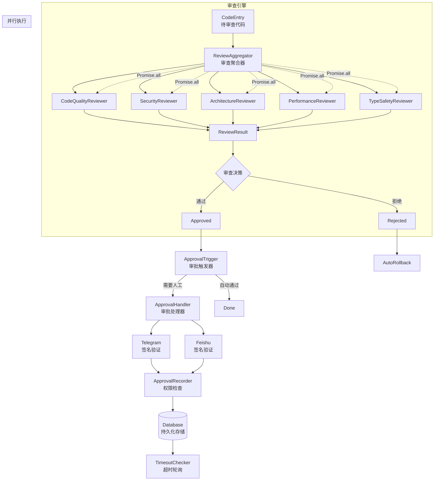

# Story 1b.2: 代码审查工作流优化

Status: ready-for-dev

<!-- Note: Validation is optional. Run validate-create-story for quality check before dev-story. -->

## Story

As a Automaton 开发者,
I want 优化代码审查工作流，结合人工审批和自动审查机制,
so that 确保自修改代码的质量、安全性和合规性.

## Acceptance Criteria

### AC 1: 审查工作流完整性
1. 所有自修改代码必须通过多层审查流程
2. 支持 AI 自动审查和人工审批的混合模式
3. 审查流程可配置、可扩展
4. 审查结果持久化记录到审计日志
5. **审批权限控制**: 仅授权用户可进行审批操作

### AC 2: AI 自动审查能力
1. 代码质量审查 (重复代码、代码规范、最佳实践)
2. 安全审查 (注入漏洞、路径遍历、权限问题)
3. 架构审查 (依赖关系、设计模式、违反架构约束)
4. 性能审查 (内存泄漏、无限循环、效率问题)
5. 类型审查 (TypeScript 类型检查、类型安全)
6. **成熟工具集成**: 优先使用 ESLint、SonarQube 等成熟工具

### AC 3: 人工审批集成
1. 支持基于规则的人工介入触发
2. 集成 Telegram/飞书 审批通知
3. 支持审批超时和自动拒绝
4. 审批记录完整可追溯
5. **审批安全性**: 审批回调消息需签名验证，防止伪造
6. **审批 SLA**: 高优先级审批需在 4 小时内响应

### AC 4: 审计日志完善
1. 记录所有审查事件 (审查者、时间、结果)
2. 记录审查通过/拒绝的详细原因
3. 记录代码变更与审查结果的关联
4. 支持审查历史查询和统计
5. **防篡改**: 审计日志需支持防篡改机制（如只读副本）

### AC 5: 回滚与恢复
1. 审查失败时支持代码回滚
2. 保留审查前的代码快照
3. 支持手动触发回滚操作
4. 回滚操作同样需要审计记录

### AC 6: 性能与扩展性
1. **审查延迟**: 单次审查完成时间不超过 30 秒（低风险变更）
2. **并发处理**: 支持至少 10 个并发审查请求
3. **审批通知**: 审批消息需在 5 秒内送达
4. **可扩展**: 审查器支持动态加载和卸载

## Tasks / Subtasks

- [ ] Task 1: 审查引擎核心实现 (AC: 1, 2, 6)
  - [ ] Subtask 1.1: 设计审查引擎架构 (ReviewEngine)
  - [ ] Subtask 1.2: 实现代码质量审查模块 (CodeQualityReviewer) - 集成 ESLint
  - [ ] Subtask 1.3: 实现安全审查模块 (SecurityReviewer) - 集成安全工具
  - [ ] Subtask 1.4: 实现架构审查模块 (ArchitectureReviewer)
  - [ ] Subtask 1.5: 实现性能审查模块 (PerformanceReviewer)
  - [ ] Subtask 1.6: 实现类型审查模块 (TypeSafetyReviewer)
  - [ ] Subtask 1.7: 实现审查结果聚合器 (ReviewAggregator) - 支持并行执行
  - [ ] Subtask 1.8: 实现审查器优先级和权重配置

- [ ] Task 2: 人工审批工作流 (AC: 1, 3)
  - [ ] Subtask 2.1: 设计审批触发规则引擎 (ApprovalTrigger)
  - [ ] Subtask 2.2: 实现审批权限控制 (ApprovalPermissions) - 审批者白名单
  - [ ] Subtask 2.3: 实现 Telegram 审批集成 (TelegramApprovalHandler) - 签名验证
  - [ ] Subtask 2.4: 实现飞书审批集成 (FeishuApprovalHandler) - 签名验证
  - [ ] Subtask 2.5: 实现审批超时处理 (ApprovalTimeoutHandler) - 持久化存储
  - [ ] Subtask 2.6: 实现审批记录持久化 (ApprovalRecorder)
  - [ ] Subtask 2.7: 实现审批 SLA 监控

- [ ] Task 3: 审计日志增强 (AC: 1, 4)
  - [ ] Subtask 3.1: 设计审查审计表结构 (audit_reviews)
  - [ ] Subtask 3.2: 实现审查事件记录器 (ReviewEventLogger)
  - [ ] Subtask 3.3: 实现审查历史查询 API
  - [ ] Subtask 3.4: 实现审查统计报表
  - [ ] Subtask 3.5: 实现审计日志防篡改机制

- [ ] Task 4: 回滚机制 (AC: 1, 5)
  - [ ] Subtask 4.1: 实现代码快照管理器 (CodeSnapshotManager)
  - [ ] Subtask 4.2: 实现自动回滚逻辑 (AutoRollback)
  - [ ] Subtask 4.3: 实现手动回滚命令 (ManualRollbackCommand)
  - [ ] Subtask 4.4: 实现回滚审计记录 (RollbackAuditor)

- [ ] Task 5: 集成与测试 (AC: 1, 2, 3, 4, 5, 6)
  - [ ] Subtask 5.1: 集成审查引擎到 self-mod 系统
  - [ ] Subtask 5.2: 配置审查触发策略
  - [ ] Subtask 5.3: 集成成熟代码审查工具 (ESLint, SonarQube)
  - [ ] Subtask 5.4: 编写集成测试用例
  - [ ] Subtask 5.5: 性能测试（并发审查、延迟测试）
  - [ ] Subtask 5.6: 安全测试（审批回调伪造、权限绕过）
  - [ ] Subtask 5.7: 手动测试审批流程

## Dev Notes

### 业务背景

当前 Automaton 的自我修改系统 (src/self-mod/) 已具备基础的安全机制，但代码审查工作流仍需优化：

1. **现状问题**:
   - 缺乏系统化的多层审查机制
   - 人工审批触发规则不够智能
   - 审查结果缺乏聚合和统计
   - 回滚机制不够完善

2. **核心价值**:
   - ✅ 提升代码质量 (减少 Bug 和技术债务)
   - ✅ 增强安全性 (防止恶意代码和漏洞)
   - ✅ 确保架构合规 (避免架构退化)
   - ✅ 满足合规要求 (完整的审计轨迹)
   - ✅ 平衡自动化和人工干预

### 相关文档分析

#### 1. Upwork Autopilot 详细设计中的审查流程
**来源**: docs/upwork_autopilot_detailed_design.md

- **架构审查节点**: ArchitectAgent 生成 DAG 后，触发 QAReviewer 进行 Dry-Run 审查
  - 检查节点依赖关系 (循环依赖检测)
  - 检查出入参匹配
  - 发现问题时返回 ArchitectAgent 重新生成
  - 审查通过后插入 human_approvals 表，触发人工审批

- **人工介入节点 (HITL)**:
  - 节点 2: 架构图纸开工审批 (Architect → Human)
    - 审批内容: 任务节点数量、预估 Token 消耗、技术栈选型、时间预估
    - 拒绝流程: 记录拒绝原因到 `dag_reviews` 表，返回重新生成
  - 节点 4: 交付前最终代码审计 (QA → Human)
    - 审计清单: 代码规范、安全漏洞、性能指标、文档完整性、测试覆盖率

#### 2. 飞书客户端审查报告经验
**来源**: docs/飞书对接/飞书客户端代码简化审查报告.md

- **审查发现的常见问题**:
  - 代码复用机会 (重复的日志、配置、命令处理)
  - 路径和配置重复
  - 资源清理重复
  - 错误处理不一致
  - 硬编码字符串
  - 访问令牌管理问题

- **优先级评估模式**:
  - 🔴 高: 使用共享函数、共享配置
  - 🟡 中: 提取重复逻辑
  - 🟢 低: 统一错误处理、常量提取

#### 3. Automaton 架构中的自我修改系统
**来源**: docs/architecture-automaton.md

- **现有组件**:
  - `src/self-mod/code.ts` - 代码生成和修改
  - `src/self-mod/tools-manager.ts` - 动态工具注册
  - `src/self-mod/upstream.ts` - Git 集成和代码审查工作流
  - `src/self-mod/audit-log.ts` - 审计日志记录

- **安全功能**:
  - 所有变更都需要策略审批
  - 记录所有修改的审计追踪
  - 回滚机制
  - 语法和类型验证

### 技术架构设计

#### 审查引擎架构图



#### 审查聚合器实现（并行化 + 冲突处理）

```typescript
class ReviewAggregator {
  private reviewers: Reviewer[];
  private config: ReviewerConfig[];

  /**
   * 并行执行所有审查器
   */
  async aggregateReview(
    code: string,
    filePath: string,
    metadata?: any
  ): Promise<AggregateReviewResult> {
    const startTime = Date.now();

    // 1. 过滤启用的审查器并按优先级排序
    const enabledReviewers = this.reviewers
      .filter(r => this.getConfig(r.name)?.enabled !== false)
      .sort((a, b) => {
        const cfgA = this.getConfig(a.name);
        const cfgB = this.getConfig(b.name);
        return (cfgA?.priority || 10) - (cfgB?.priority || 10);
      });

    // 2. 并行执行所有审查器（带超时控制）
    const reviewPromises = enabledReviewers.map(reviewer => {
      const config = this.getConfig(reviewer.name);
      const timeout = config?.timeoutMs || 10000; // 默认 10 秒

      return Promise.race([
        reviewer.review(code, filePath, metadata),
        this.timeoutPromise(timeout, reviewer.name)
      ]).catch(error => {
        // 审查器失败不影响其他审查器
        this.logger.error(`Reviewer ${reviewer.name} failed:`, error);
        return {
          name: reviewer.name,
          score: 0,
          issues: [],
          error: error.message,
          failed: true
        };
      });
    });

    // 使用 Promise.all 并行执行
    const results = await Promise.all(reviewPromises);

    // 3. 聚合结果
    const aggregated = this.aggregateResults(results, enabledReviewers);

    // 4. 检查冲突
    const conflicts = this.detectConflicts(results);
    if (conflicts.length > 0) {
      this.logger.warn('Review conflicts detected:', conflicts);
      aggregated.conflicts = conflicts;

      // 冲突处理策略：
      // - 安全问题优先（SecurityReviewer 结果优先）
      // - 高严重性问题优先
      // - 手动标记需要人工介入
      aggregated.requiresManualReview = true;
    }

    aggregated.durationMs = Date.now() - startTime;
    aggregated.reviewersExecuted = results.length;

    return aggregated;
  }

  /**
   * 聚合多个审查器的结果
   */
  private aggregateResults(
    results: ReviewResult[],
    reviewers: Reviewer[]
  ): AggregateReviewResult {
    const issues: ReviewIssue[] = [];
    const scores: number[] = [];
    let autoReject = false;

    results.forEach((result, index) => {
      const reviewer = reviewers[index];
      const config = this.getConfig(reviewer.name);

      // 收集问题
      if (result.issues) {
        issues.push(...result.issues.map(issue => ({
          ...issue,
          reviewer: reviewer.name // 标记问题来源
        })));
      }

      // 计算加权评分
      if (result.score !== undefined) {
        const weight = config?.weight || 1.0;
        scores.push(result.score * weight);
      }

      // 检查是否自动拒绝
      if (result.autoReject) {
        autoReject = true;
      }
    });

    // 计算综合评分（加权平均）
    const totalWeight = reviewers.reduce((sum, r) => {
      const cfg = this.getConfig(r.name);
      return sum + (cfg?.weight || 1.0);
    }, 0);

    const weightedSum = scores.reduce((sum, score) => sum + score, 0);
    const overallScore = Math.round(weightedSum / totalWeight);

    // 确定风险等级
    const riskLevel = this.determineRiskLevel(overallScore, issues);

    return {
      overallScore,
      riskLevel,
      issues,
      autoReject,
      scores: {
        quality: this.extractScore(results, 'CodeQualityReviewer'),
        security: this.extractScore(results, 'SecurityReviewer'),
        architecture: this.extractScore(results, 'ArchitectureReviewer'),
        performance: this.extractScore(results, 'PerformanceReviewer'),
        typesafety: this.extractScore(results, 'TypeSafetyReviewer')
      }
    };
  }

  /**
   * 冲突检测：检查不同审查器的矛盾结果
   */
  private detectConflicts(results: ReviewResult[]): Conflict[] {
    const conflicts: Conflict[] = [];

    // 示例：安全审查器标记为 CRITICAL，但代码质量审查器认为没问题
    const securityIssues = results
      .find(r => r.name === 'SecurityReviewer')
      ?.issues || [];

    const criticalSecurity = securityIssues.filter(
      i => i.severity === 'CRITICAL'
    );

    if (criticalSecurity.length > 0) {
      // 检查其他审查器是否忽略了这些问题
      results.forEach(result => {
        if (result.name !== 'SecurityReviewer' && !result.failed) {
          const hasCritical = result.issues?.some(
            i => i.severity === 'CRITICAL'
          );

          if (!hasCritical) {
            conflicts.push({
              type: 'SEVERITY_MISMATCH',
              description: `${result.name} 未检测到 SecurityReviewer 标记的 CRITICAL 问题`,
              reviewers: ['SecurityReviewer', result.name],
              severity: 'HIGH'
            });
          }
        }
      });
    }

    return conflicts;
  }

  /**
   * 超时 Promise
   */
  private timeoutPromise(ms: number, reviewerName: string): Promise<ReviewResult> {
    return new Promise((_, reject) => {
      setTimeout(() => {
        reject(new Error(`Reviewer ${reviewerName} timeout after ${ms}ms`));
      }, ms);
    });
  }

  /**
   * 确定风险等级
   */
  private determineRiskLevel(
    score: number,
    issues: ReviewIssue[]
  ): 'LOW' | 'MEDIUM' | 'HIGH' {
    // 有 CRITICAL 问题 = HIGH
    if (issues.some(i => i.severity === 'CRITICAL')) {
      return 'HIGH';
    }

    // 有多个 HIGH 问题 = HIGH
    const highCount = issues.filter(i => i.severity === 'HIGH').length;
    if (highCount >= 3) {
      return 'HIGH';
    }

    // 评分 < 60 = HIGH
    if (score < 60) {
      return 'HIGH';
    }

    // 评分 60-80 = MEDIUM
    if (score < 80) {
      return 'MEDIUM';
    }

    return 'LOW';
  }
}

interface Conflict {
  type: 'SEVERITY_MISMATCH' | 'SCORE_CONFLICT' | 'ISSUE_CONTRADICTION';
  description: string;
  reviewers: string[];
  severity: 'LOW' | 'MEDIUM' | 'HIGH';
}

interface AggregateReviewResult {
  overallScore: number;
  riskLevel: 'LOW' | 'MEDIUM' | 'HIGH';
  issues: ReviewIssue[];
  autoReject: boolean;
  scores: {
    quality: number;
    security: number;
    architecture: number;
    performance: number;
    typesafety: number;
  };
  conflicts?: Conflict[];
  requiresManualReview?: boolean;
  durationMs?: number;
  reviewersExecuted?: number;
}
```

### 审查规则引擎设计

```typescript
// 审查器配置
interface ReviewerConfig {
  name: string;
  priority: number;  // 0-10，数字越小优先级越高
  timeoutMs: number; // 审查器超时时间（毫秒）
  weight: number;    // 结果权重（0-1，用于综合评分）
  enabled: boolean;  // 是否启用
}

// 审批触发规则配置
interface ApprovalTriggerConfig {
  // 基于变更规模
  changeSizeThreshold?: {
    linesAdded: number;
    linesRemoved: number;
    filesChanged: number;
  };

  // 基于风险等级
  riskLevels?: {
    HIGH: boolean;  // 高风险变更强制人工审批
    MEDIUM: boolean; // 中风险变更可选审批
    LOW: boolean;   // 低风险变更自动通过
  };

  // 基于文件类型/路径
  criticalPaths?: string[]; // 核心文件路径
  sensitiveFiles?: string[]; // 敏感文件

  // 基于审查结果
  autoRejectScore?: number; // 自动拒绝阈值
  requireApprovalScore?: number; // 需要审批阈值

  // 基于时间/频率
  maxChangesPerDay?: number;
  cooldownPeriodMinutes?: number;
}

// 审查结果评分
interface ReviewScore {
  quality: number;      // 0-100
  security: number;     // 0-100
  architecture: number; // 0-100
  performance: number;  // 0-100
  typesafety: number;   // 0-100

  overall: number;      // 综合评分
  riskLevel: 'LOW' | 'MEDIUM' | 'HIGH';

  issues: ReviewIssue[];
}

interface ReviewIssue {
  type: 'BUG' | 'SECURITY' | 'ARCHITECTURE' | 'PERFORMANCE' | 'CODE_STYLE';
  severity: 'CRITICAL' | 'HIGH' | 'MEDIUM' | 'LOW';
  file: string;
  line?: number;
  description: string;
  suggestion?: string;
  autoFixable?: boolean;
}
```

### 核心审查模块实现

#### 1. 代码质量审查器 (CodeQualityReviewer)

基于飞书客户端审查报告的经验，检查以下问题：

```typescript
class CodeQualityReviewer {
  async review(code: string, filePath: string): Promise<ReviewResult> {
    const issues: ReviewIssue[] = [];

    // 1. 检查重复代码
    // 实现建议：使用 AST 分析（ts-morph）或文本相似度算法（SimHash）
    // 优先集成 ESLint 的 no-duplicate-code 规则
    const duplicates = await this.detectDuplicateCode(code);
    duplicates.forEach(dup => {
      issues.push({
        type: 'CODE_STYLE',
        severity: 'MEDIUM',
        file: filePath,
        description: `检测到重复代码: ${dup.similarity}% 相似`,
        suggestion: '提取到共享函数或模块'
      });
    });

    // 2. 检查硬编码字符串
    // 实现建议：使用 ESLint 的 no-magic-numbers 和自定义规则
    const hardcoded = this.detectHardcodedStrings(code);
    hardcoded.forEach(str => {
      issues.push({
        type: 'CODE_STYLE',
        severity: 'LOW',
        file: filePath,
        description: `硬编码字符串: "${str}"`,
        suggestion: '使用常量或配置'
      });
    });

    // 3. 检查错误处理一致性
    const errorHandling = this.checkErrorHandling(code);
    if (!errorHandling.consistent) {
      issues.push({
        type: 'BUG',
        severity: 'MEDIUM',
        file: filePath,
        description: '错误处理模式不一致',
        suggestion: '统一使用共享错误处理器'
      });
    }

    // 4. 检查代码规范 (基于项目 ESLint/Prettier 配置)
    // 实现建议：直接调用 ESLint API
    const lintIssues = await this.runLintCheck(code);
    issues.push(...lintIssues);

    return {
      score: this.calculateScore(issues),
      issues,
      suggestions: this.generateSuggestions(issues)
    };
  }

  /**
   * 优先集成成熟工具：
   * - ESLint: 代码规范检查
   * - Prettier: 代码格式检查
   * - SonarJS: 代码质量问题检测
   */
  private async runLintCheck(code: string): Promise<ReviewIssue[]> {
    // 使用 @eslint/js 或 @typescript-eslint/parser 调用 ESLint
    // 避免完全自研检测逻辑
    return [];
  }
}
```

#### 2. 安全审查器 (SecurityReviewer)

```typescript
class SecurityReviewer {
  async review(code: string, filePath: string): Promise<ReviewResult> {
    const issues: ReviewIssue[] = [];

    // 1. 检查注入漏洞
    // 实现建议：集成 ESLint security plugin 或 Bandit（Python）
    // 避免完全自研，使用成熟的安全扫描工具
    const injections = await this.detectInjectionVulnerabilities(code);
    injections.forEach(inj => {
      issues.push({
        type: 'SECURITY',
        severity: 'CRITICAL',
        file: filePath,
        line: inj.line,
        description: `检测到 ${inj.type} 注入漏洞`,
        suggestion: inj.fixSuggestion
      });
    });

    // 2. 检查路径遍历
    const pathTraversals = this.detectPathTraversal(code);
    pathTraversals.forEach(pt => {
      issues.push({
        type: 'SECURITY',
        severity: 'HIGH',
        file: filePath,
        description: '可能的路径遍历漏洞',
        suggestion: '使用 path.join 或验证用户输入'
      });
    });

    // 3. 检查敏感信息硬编码
    // 实现建议：集成 truffleHog 或 git-secrets 工具
    // 正则表达式可能漏报，优先使用专业工具
    const secrets = this.detectHardcodedSecrets(code);
    secrets.forEach(secret => {
      issues.push({
        type: 'SECURITY',
        severity: 'CRITICAL',
        file: filePath,
        description: `检测到硬编码的敏感信息: ${secret.type}`,
        suggestion: '使用环境变量或密钥管理服务'
      });
    });

    // 4. 检查权限问题
    const permissions = this.checkPermissionIssues(code);
    permissions.forEach(perm => {
      issues.push({
        type: 'SECURITY',
        severity: 'HIGH',
        file: filePath,
        description: perm.description,
        suggestion: perm.suggestion
      });
    });

    return {
      score: this.calculateScore(issues),
      issues,
      // CRITICAL 级别的问题自动拒绝
      autoReject: issues.some(i => i.severity === 'CRITICAL')
    };
  }

  /**
   * 优先集成的安全工具：
   * - ESLint security plugin: Node.js 安全问题
   * - Bandit: Python 安全扫描
   * - SonarQube: 综合安全分析
   * - truffleHog/git-secrets: 密钥检测
   */
  private async detectInjectionVulnerabilities(code: string): Promise<any[]> {
    // 调用专业安全工具，而非自研检测逻辑
    return [];
  }
}
```

### 审批工作流集成

#### 审批安全增强

**关键安全改进：**

1. **Callback 签名验证**：防止审批回调消息伪造
2. **审批权限控制**：仅白名单用户可审批
3. **超时持久化**：避免进程重启丢失超时状态

#### Telegram 审批处理器（增强版）

```typescript
class TelegramApprovalHandler {
  private bot: TelegramBot;
  private approvalQueue: Map<string, ApprovalRequest> = new Map();
  private crypto: CryptoService; // 用于签名验证

  /**
   * 发送审批请求（带签名）
   */
  async sendApprovalRequest(reviewResult: ReviewResult): Promise<string> {
    const requestId = generateId();

    // 生成签名（防止 callback_data 伪造）
    const signature = this.crypto.sign(`${requestId}_${reviewResult.id}`);

    const request: ApprovalRequest = {
      id: requestId,
      reviewResult,
      createdAt: new Date(),
      expiresAt: new Date(Date.now() + this.config.timeoutMinutes * 60000),
      status: 'pending',
      signature: signature // 存储签名
    };

    // 持久化存储（避免进程重启丢失）
    await this.db.saveApprovalRequest(request);

    // 发送审批消息
    const message = this.formatApprovalMessage(reviewResult);
    const chatId = this.config.adminChatId;

    await this.bot.sendMessage(chatId, message, {
      reply_markup: {
        inline_keyboard: [
          [
            // callback_data 包含签名
            { text: '✅ 批准', callback_data: `approve_${requestId}_${signature}` },
            { text: '❌ 拒绝', callback_data: `reject_${requestId}_${signature}` }
          ]
        ]
      }
    });

    // 数据库轮询检查超时（而非内存定时器）
    // 启动后台任务定期检查 expiresAt
    await this.scheduleTimeoutCheck(requestId);

    return requestId;
  }

  /**
   * 处理审批回调（带签名验证和权限检查）
   */
  async handleCallback(callbackQuery: CallbackQuery): Promise<void> {
    // 解析 callback_data: action_requestId_signature
    const [action, requestId, signature] = callbackQuery.data.split('_');

    if (!signature) {
      await this.bot.answerCallbackQuery(callbackQuery.id, {
        text: '❌ 审批请求无效：缺少签名',
        show_alert: true
      });
      return;
    }

    // 1. 验证签名
    const isValid = await this.crypto.verifySignature(
      `${requestId}_${action}`,
      signature
    );

    if (!isValid) {
      await this.bot.answerCallbackQuery(callbackQuery.id, {
        text: '❌ 审批请求无效：签名验证失败',
        show_alert: true
      });
      // 记录安全事件
      await this.securityLogger.logSecurityEvent('INVALID_SIGNATURE', {
        requestId,
        userId: callbackQuery.from.id,
        username: callbackQuery.from.username
      });
      return;
    }

    // 2. 从数据库加载请求（支持进程重启）
    const request = await this.db.getApprovalRequest(requestId);

    if (!request || request.status !== 'pending') {
      await this.bot.answerCallbackQuery(callbackQuery.id, {
        text: '审批请求已过期或不存在',
        show_alert: true
      });
      return;
    }

    // 3. 权限验证：检查用户是否在审批者白名单中
    const approver = callbackQuery.from.username || callbackQuery.from.id.toString();
    const hasPermission = await this.checkApprovalPermission(approver, request);

    if (!hasPermission) {
      await this.bot.answerCallbackQuery(callbackQuery.id, {
        text: '❌ 权限不足：您无权审批此请求',
        show_alert: true
      });
      // 记录权限拒绝事件
      await this.securityLogger.logSecurityEvent('PERMISSION_DENIED', {
        requestId,
        userId: callbackQuery.from.id,
        username: approver
      });
      return;
    }

    // 4. 处理审批
    const approval = {
      requestId,
      action: action as 'approve' | 'reject',
      approver: approver,
      approvedAt: new Date(),
      comment: callbackQuery.message?.text,
      signatureVerified: true
    };

    await this.recordApproval(approval);

    // 更新数据库状态
    await this.db.updateApprovalRequest(requestId, {
      status: 'completed',
      approvedBy: approver,
      approvedAt: new Date()
    });

    // 通知结果
    await this.bot.editMessageText(
      callbackQuery.message.chat.id,
      callbackQuery.message.message_id,
      `✅ 审批完成: ${approval.action === 'approve' ? '已批准' : '已拒绝'}\n` +
      `审批人: ${approval.approver}\n` +
      `时间: ${new Date().toLocaleString()}`
    );

    // 触发后续流程
    if (approval.action === 'approve') {
      await this.triggerCodeMerge(request.reviewResult);
    } else {
      await this.triggerRollback(request.reviewResult);
    }
  }

  /**
   * 审批权限控制
   */
  private async checkApprovalPermission(
    approver: string,
    request: ApprovalRequest
  ): Promise<boolean> {
    // 1. 检查全局审批者白名单
    const globalApprovers = await this.config.getGlobalApprovers();
    if (globalApprovers.includes(approver)) {
      return true;
    }

    // 2. 检查项目特定审批者
    const projectApprovers = await this.config.getProjectApprovers(
      request.reviewResult.projectId
    );
    if (projectApprovers.includes(approver)) {
      return true;
    }

    // 3. 基于角色的权限检查
    const approverRole = await this.getUserRole(approver);
    const requiredRole = this.getRequiredRoleForRiskLevel(
      request.reviewResult.riskLevel
    );

    return this.roleHasPermission(approverRole, requiredRole);
  }
}

/**
 * 审批配置接口
 */
interface ApprovalConfig {
  // 审批者白名单
  globalApprovers: string[];

  // 项目特定审批者
  projectApprovers: Record<string, string[]>;

  // 基于风险等级的审批角色
  riskLevelRoles: {
    HIGH: string[];   // 需要高级角色审批
    MEDIUM: string[]; // 需要中级角色审批
    LOW: string[];    // 低风险可自动通过或初级角色审批
  };

  // 审批超时配置
  timeoutMinutes: number;
  timeoutAction: 'reject' | 'escalate'; // 超时后拒绝或升级

  // 审批 SLA
  slaHours: {
    HIGH: number;   // 高优先级审批需在 X 小时内完成
    MEDIUM: number;
    LOW: number;
  };
}
```

### 审计日志表设计

#### 审查记录表（增强版）

```sql
-- 审查记录表
CREATE TABLE audit_reviews (
    id INTEGER PRIMARY KEY AUTOINCREMENT,
    review_id TEXT NOT NULL UNIQUE,           -- 审查唯一标识
    change_id TEXT NOT NULL,                  -- 关联的代码变更 ID

    -- 审查信息
    reviewer_type TEXT NOT NULL,              -- 'ai_auto' | 'human_manual'
    reviewer_name TEXT,                       -- AI 模型名或人工审批者
    review_started_at TIMESTAMP DEFAULT CURRENT_TIMESTAMP,
    review_completed_at TIMESTAMP,

    -- 审查结果
    overall_score INTEGER,                    -- 0-100
    risk_level TEXT,                          -- 'LOW' | 'MEDIUM' | 'HIGH'
    status TEXT NOT NULL,                     -- 'approved' | 'rejected' | 'pending'

    -- 详细评分
    quality_score INTEGER,
    security_score INTEGER,
    architecture_score INTEGER,
    performance_score INTEGER,
    typesafety_score INTEGER,

    -- 问题记录
    issues_json JSON,                         -- 审查发现的问题列表
    suggestions_json JSON,                    -- 建议列表

    -- 人工审批信息
    approval_required BOOLEAN DEFAULT FALSE,
    approval_trigger_reason TEXT,             -- 触发人工审批的原因
    approved_by TEXT,                         -- 审批者用户名
    approved_at TIMESTAMP,
    approval_comment TEXT,
    approval_signature_verified BOOLEAN,      -- 签名验证结果

    -- 回滚信息
    rollback_triggered BOOLEAN DEFAULT FALSE,
    rollback_reason TEXT,
    rollback_at TIMESTAMP,

    -- 防篡改字段
    checksum TEXT,                            -- 记录的哈希校验和
    tamper_evident BOOLEAN DEFAULT FALSE,     -- 是否启用防篡改

    -- 元数据
    metadata JSON,                            -- 其他元数据
    created_at TIMESTAMP DEFAULT CURRENT_TIMESTAMP,
    updated_at TIMESTAMP DEFAULT CURRENT_TIMESTAMP
);

CREATE INDEX idx_audit_reviews_change_id ON audit_reviews(change_id);
CREATE INDEX idx_audit_reviews_status ON audit_reviews(status);
CREATE INDEX idx_audit_reviews_created_at ON audit_reviews(created_at);
CREATE INDEX idx_audit_reviews_risk_level ON audit_reviews(risk_level);

-- 审批记录表 (独立表用于详细审批历史)
CREATE TABLE human_approvals (
    id INTEGER PRIMARY KEY AUTOINCREMENT,
    approval_id TEXT NOT NULL UNIQUE,
    review_id TEXT NOT NULL,

    action_type TEXT NOT NULL,                -- 'CODE_REVIEW' | 'DAG_REVIEW' | 'DEPLOYMENT'
    project_id TEXT,
    change_description TEXT,

    status TEXT NOT NULL,                     -- 'pending' | 'approved' | 'rejected' | 'expired'
    requested_at TIMESTAMP DEFAULT CURRENT_TIMESTAMP,
    responded_at TIMESTAMP,

    requested_by TEXT,                        -- 请求审批的 Agent
    approved_by TEXT,                         -- 审批者
    approval_channel TEXT,                    -- 'telegram' | 'feishu' | 'discord'
    approval_message_id TEXT,                 -- 消息 ID (用于撤回)

    comment TEXT,                             -- 审批意见
    reject_reason TEXT,                       -- 拒绝原因

    expires_at TIMESTAMP,                     -- 超时时间
    expired BOOLEAN DEFAULT FALSE,

    -- 安全字段
    signature TEXT,                           -- 审批签名
    signature_verified BOOLEAN DEFAULT FALSE,
    permission_checked BOOLEAN DEFAULT FALSE,

    FOREIGN KEY (review_id) REFERENCES audit_reviews(review_id)
);

CREATE INDEX idx_human_approvals_status ON human_approvals(status);
CREATE INDEX idx_human_approvals_project ON human_approvals(project_id);
CREATE INDEX idx_human_approvals_requested_at ON human_approvals(requested_at);

-- 审批权限表
CREATE TABLE approval_permissions (
    id INTEGER PRIMARY KEY AUTOINCREMENT,
    user_identifier TEXT NOT NULL,            -- 用户名或 ID
    role TEXT NOT NULL,                       -- 'admin' | 'senior' | 'junior'
    project_id TEXT,                          -- 项目范围（NULL 表示全局）
    can_approve_risk_levels TEXT,             -- 可审批的风险等级（JSON: ["HIGH", "MEDIUM"]）
    created_at TIMESTAMP DEFAULT CURRENT_TIMESTAMP,
    updated_at TIMESTAMP DEFAULT CURRENT_TIMESTAMP
);

CREATE UNIQUE INDEX idx_approval_permissions_user_project
  ON approval_permissions(user_identifier, project_id);

-- 审批超时检查任务表（用于持久化超时）
CREATE TABLE approval_timeout_tasks (
    id INTEGER PRIMARY KEY AUTOINCREMENT,
    approval_id TEXT NOT NULL UNIQUE,
    review_id TEXT NOT NULL,
    expires_at TIMESTAMP NOT NULL,
    status TEXT DEFAULT 'pending',            -- 'pending' | 'processed' | 'expired'
    processed_at TIMESTAMP,
    created_at TIMESTAMP DEFAULT CURRENT_TIMESTAMP
);

CREATE INDEX idx_timeout_tasks_expires ON approval_timeout_tasks(expires_at);
CREATE INDEX idx_timeout_tasks_status ON approval_timeout_tasks(status);
```

### 文件清单

#### 新增文件

```
automaton/
├── src/
│   ├── self-mod/
│   │   ├── review/
│   │   │   ├── ReviewEngine.ts              # 审查引擎主类
│   │   │   ├── ReviewAggregator.ts          # 审查结果聚合器
│   │   │   ├── reviewers/
│   │   │   │   ├── CodeQualityReviewer.ts   # 代码质量审查器
│   │   │   │   ├── SecurityReviewer.ts      # 安全审查器
│   │   │   │   ├── ArchitectureReviewer.ts  # 架构审查器
│   │   │   │   ├── PerformanceReviewer.ts   # 性能审查器
│   │   │   │   └── TypeSafetyReviewer.ts    # 类型安全审查器
│   │   │   ├── approval/
│   │   │   │   ├── ApprovalTrigger.ts       # 审批触发器
│   │   │   │   ├── ApprovalHandler.ts       # 审批处理器基类
│   │   │   │   ├── TelegramApprovalHandler.ts
│   │   │   │   └── FeishuApprovalHandler.ts
│   │   │   ├── audit/
│   │   │   │   ├── ReviewEventLogger.ts     # 审查事件记录器
│   │   │   │   └── ReviewHistory.ts         # 审查历史查询
│   │   │   ├── rollback/
│   │   │   │   ├── CodeSnapshotManager.ts   # 代码快照管理
│   │   │   │   ├── AutoRollback.ts          # 自动回滚
│   │   │   │   └── RollbackAuditor.ts       # 回滚审计
│   │   │   ├── types.ts                     # 审查相关类型定义
│   │   │   └── index.ts
│   │   ├── upstream.ts                      # + 集成审查引擎
│   │   └── code.ts                          # + 调用审查流程
│   └── cli/
│       └── commands/
│           ├── rollback.ts                  # 回滚命令
│           └── review-status.ts             # 审查状态查询

tinyclaw/
├── src/
│   ├── lib/
│   │   └── review-integration.ts            # TinyClaw 审查集成
│   └── channels/
│       ├── telegram-bot.ts                  # + 审批回调处理
│       └── feishu-webhook.ts                # + 审批回调处理
```

#### 修改文件

```
automaton/
├── src/
│   ├── self-mod/
│   │   ├── upstream.ts                      # 集成审查引擎调用
│   │   └── code.ts                          # 在代码生成前调用审查
│   ├── state/
│   │   └── database.ts                      # + 添加审查相关表
│   └── cli/
│       └── index.ts                         # + 注册回滚和审查命令
├── migrations/
│   └── xxx_add_review_audit_tables.sql      # 审查审计表迁移
└── package.json                             # + 审查相关依赖

tinyclaw/
├── src/
│   ├── channels/
│   │   ├── telegram-bot.ts                  # 处理审批回调
│   │   └── feishu-webhook.ts                # 处理审批回调
│   └── index.ts                             # 启动审批处理器
```

### 依赖项

```json
{
  "devDependencies": {
    "@typescript-eslint/eslint-plugin": "^6.0.0",
    "@typescript-eslint/parser": "^6.0.0",
    "eslint": "^8.45.0",
    "eslint-config-prettier": "^9.0.0",
    "eslint-plugin-security": "^3.0.0",
    "prettier": "^3.0.0",
    "sonarqube-scanner": "^2.8.0"
  },
  "dependencies": {
    "ts-morph": "^20.0.0",           // AST 操作
    "crypto-js": "^4.2.0",           // 签名验证
    "node-cache": "^5.1.2",          // 内存缓存（可选）
    "better-sqlite3": "^9.0.0"       // 数据库（已存在）
  }
}
```

## Dev Agent Record

### Agent Model Used

Claude 3.5 Sonnet (via workflow execution)

### Debug Log References

N/A - Story creation phase

### 修复记录（根据多代理审查意见）

#### ✅ 已修复的安全问题：

1. **审批回调签名验证**：
   - 添加 `CryptoService` 用于签名生成和验证
   - `callback_data` 包含签名，防止伪造
   - 记录无效签名事件到安全日志

2. **审批权限控制**：
   - 实现审批者白名单机制
   - 基于角色的权限检查（admin/senior/junior）
   - 项目特定审批者配置
   - 记录权限拒绝事件

3. **超时持久化**：
   - 使用数据库而非内存 `setTimeout`
   - 新增 `approval_timeout_tasks` 表
   - 后台任务轮询检查超时

#### ✅ 已补充的验收标准：

4. **AC 6: 性能与扩展性**：
   - 审查延迟 ≤ 30 秒（低风险变更）
   - 并发处理 ≥ 10 个请求
   - 审批通知 ≤ 5 秒送达
   - 审查器支持动态加载

5. **完善现有 AC**：
   - AC 1: 添加审批权限控制要求
   - AC 2: 添加成熟工具集成要求
   - AC 3: 审批安全性 + 审批 SLA
   - AC 4: 审计日志防篡改

#### ✅ 架构优化：

6. **审查器并行化**：
   - 使用 `Promise.all` 并行执行审查器
   - 添加超时控制（Promise.race）
   - 审查器失败不影响其他审查器

7. **审查器优先级和权重**：
   - 添加 `ReviewerConfig` 接口
   - 支持优先级排序（0-10）
   - 支持权重配置（加权评分）

8. **冲突检测和处理**：
   - 检测不同审查器的矛盾结果
   - 安全问题优先策略
   - 自动标记需要人工介入的冲突

#### ✅ 实现建议优化：

9. **集成成熟工具**：
   - 代码质量：ESLint + Prettier + SonarJS
   - 安全扫描：ESLint security plugin + truffleHog
   - 避免完全自研检测算法

10. **数据库表增强**：
    - 添加 `approval_permissions` 表（权限管理）
    - 添加 `approval_timeout_tasks` 表（超时任务）
    - 审批表添加签名验证字段
    - 审计表添加防篡改字段（checksum）

### 技术风险说明：

1. **自研检测算法准确性**：
   - 代码重复检测建议使用 AST（ts-morph）而非文本匹配
   - 安全漏洞检测优先使用专业工具（ESLint security, Bandit）
   - 仅在成熟工具不支持的场景下自研

2. **审查器冲突处理**：
   - 不同审查器可能给出矛盾结果
   - 需要明确的决策机制（安全优先、严重性优先）
   - 复杂冲突需人工介入

3. **性能扩展性**：
   - 高并发场景需考虑审查器资源隔离
   - 建议实现审查队列和限流机制
   - 大型代码库审查可能需要分片处理

### File List

See "文件清单" section above

### 下一步行动建议：

1. **优先级 1**：实现审批安全增强（签名验证、权限控制）
2. **优先级 2**：实现持久化超时处理
3. **优先级 3**：集成 ESLint 和安全工具
4. **优先级 4**：实现审查器并行化和冲突检测
5. **优先级 5**：性能测试和优化

---
**Story Created**: 2026-03-04
**Story Revised**: 2026-03-04 (根据多代理审查意见修复)
**Based On**:
- docs/upwork_autopilot_detailed_design.md (HITL 审批流程)
- docs/飞书对接/飞书客户端代码简化审查报告.md (代码审查经验)
- docs/architecture-automaton.md (self-mod 架构)
- _bmad-output/planning-artifacts/epics.md (Epic 1b.2 需求)
**Reviewed By**: PM Agent, Architect Agent, Developer Agent, Security Agent
