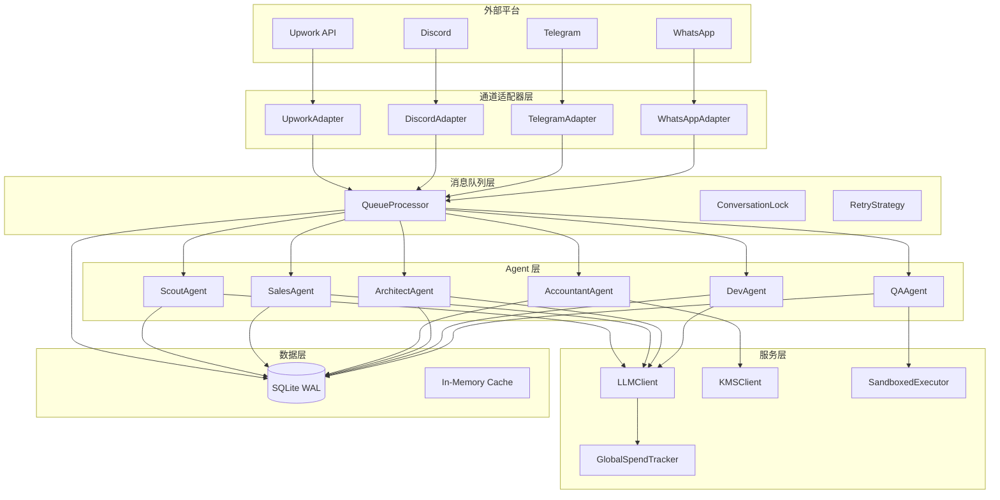
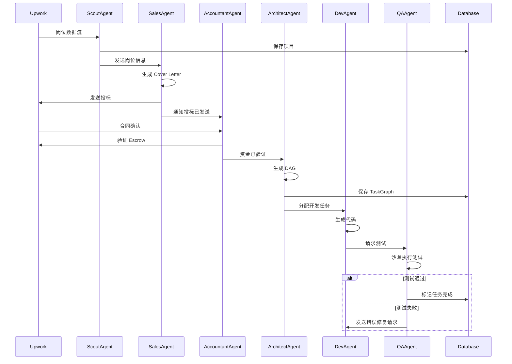
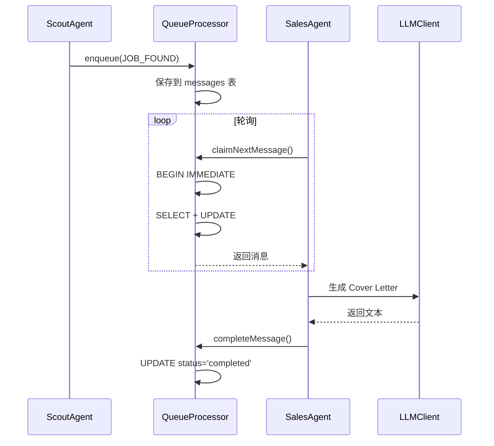

# UpworkAutoPilot 实施计划

## 1. 项目概览 (Project Overview)

### 1.1 项目基本信息
- **项目名称**: UpworkAutoPilot - AI Agent 自动化接单系统
- **项目周期**: 16 周 (80 人天)
- **团队规模**: 4 人 (3 后端 + 1 测试/运维)
- **开发模式**: 敏捷迭代 (2周冲刺)

### 1.2 总工期估算
| 阶段 | 工时估算 | 周期 |
|------|---------|------|
| 数据库层 + 消息队列核心 | 15 人天 | 2 周 |
| Agent 工厂 (Scout/Sales) + 通道适配 | 20 人天 | 3 周 |
| Accountant + Architect + DAG生成 | 18 人天 | 3 周 |
| Dev/QA Agent + 沙盒执行 | 22 人天 | 4 周 |
| Automaton 策略引擎 + Web3集成 | 12 人天 | 2 周 |
| 监控 + 安全加固 + 集成测试 | 13 人天 | 2 周 |
| **总计** | **100 人天** | **16 周** |

> **注**: 由于存在大量可并行任务，实际日历周期为 16 周（80 人天）

### 1.3 关键里程碑节点

| 里程碑 | 时间点 | 交付物 |
|-------|--------|--------|
| **M1: 基础设施就绪** | 第 2 周 | SQLite WAL 数据库 + 消息队列核心 + API 框架 |
| **M2: 投标流程闭环** | 第 5 周 | ScoutAgent + SalesAgent + Upwork 通道 + 谈判能力 |
| **M3: 资金与架构就绪** | 第 8 周 | AccountantAgent + Escrow 验证 + ArchitectAgent + DAG 生成 |
| **M4: 代码开发闭环** | 第 12 周 | DevAgent + QAAgent + 沙盒执行 + 测试循环 |
| **M5: 策略与安全就绪** | 第 14 周 | Automaton 核心 + GlobalSpendTracker + KMS 集成 |
| **M6: 生产就绪** | 第 16 周 | 全链路集成测试 + 监控告警 + 安全加固 + 上线文档 |

### 1.4 团队配置建议

| 角色 | 人数 | 职责 |
|------|------|------|
| 后端开发工程师 | 3 | 数据库、消息队列、Agent 实现、API、集成 |
| 测试工程师 | 1 | 单元测试、集成测试、性能测试、安全测试 |
| 运维工程师 | 0.5 (兼职) | 部署、监控、故障排查 |
| 项目经理 | 0.5 (兼职) | 进度管理、风险管理、协调 |
| **总计** | **4 人** | - |

---

## 2. 功能点级实施计划

### 2.1 数据库层 (Database Layer)

| 模块 | 子模块 | 功能点ID | 功能点描述 | 技术实现要点 | 任务类型 | 预估工时 | 依赖项 | 交付物 | 风险等级 |
|------|--------|----------|------------|--------------|----------|----------|--------|--------|----------|
| 数据库层 | 初始化 | DB-001 | SQLite WAL 模式配置 | PRAGMA journal_mode=WAL, PRAGMA mmap_size=256MB | 后端开发 | 1d | - | db.ts 配置文件 | 低 |
| 数据库层 | 初始化 | DB-002 | 数据库连接池封装 | better-sqlite3 单例模式, 连接复用 | 后端开发 | 1d | DB-001 | database/connection.ts | 低 |
| 数据库层 | 表结构 | DB-003 | messages 表创建 | CREATE TABLE messages + 4个索引 | 数据库脚本 | 1d | DB-002 | migrations/001_messages.sql | 低 |
| 数据库层 | 表结构 | DB-004 | conversations 表创建 | CREATE TABLE conversations + 2个索引 | 数据库脚本 | 0.5d | DB-002 | migrations/002_conversations.sql | 低 |
| 数据库层 | 表结构 | DB-005 | conversation_locks 表创建 | CREATE TABLE conversation_locks | 数据库脚本 | 0.5d | DB-002 | migrations/003_locks.sql | 低 |
| 数据库层 | 表结构 | DB-006 | task_graph 表创建 | CREATE TABLE task_graph + 3个索引 | 数据库脚本 | 1d | DB-002 | migrations/004_task_graph.sql | 低 |
| 数据库层 | 表结构 | DB-007 | projects 表创建 | CREATE TABLE projects + 3个索引 | 数据库脚本 | 1d | DB-002 | migrations/005_projects.sql | 低 |
| 数据库层 | 表结构 | DB-008 | token_audit_log 表创建 | CREATE TABLE token_audit_log + 2个索引 | 数据库脚本 | 0.5d | DB-002 | migrations/006_token_audit.sql | 低 |
| 数据库层 | 表结构 | DB-009 | agent_configs 表创建 | CREATE TABLE agent_configs | 数据库脚本 | 0.5d | DB-002 | migrations/007_agent_configs.sql | 低 |
| 数据库层 | 表结构 | DB-010 | human_approvals 表创建 | CREATE TABLE human_approvals + 2个索引 | 数据库脚本 | 0.5d | DB-002 | migrations/008_approvals.sql | 低 |
| 数据库层 | 工具 | DB-011 | 数据库迁移工具 | 版本化迁移脚本执行器 | 后端开发 | 2d | DB-001~DB-010 | lib/db-migrator.ts | 中 |
| 数据库层 | 工具 | DB-012 | 事务封装工具 | withTransaction() 装饰器 | 后端开发 | 1d | DB-002 | lib/transaction.ts | 低 |
| 数据库层 | 工具 | DB-013 | 批量操作工具 | batchInsertMessages() | 后端开发 | 1d | DB-002 | lib/batch-operations.ts | 低 |

**小计**: 11.5 人天

### 2.2 消息队列核心 (Message Queue Core)

| 模块 | 子模块 | 功能点ID | 功能点描述 | 技术实现要点 | 任务类型 | 预估工时 | 依赖项 | 交付物 | 风险等级 |
|------|--------|----------|------------|--------------|----------|----------|--------|--------|----------|
| 消息队列 | 入队 | MQ-001 | 消息入队接口 | POST /api/messages/enqueue, 插入 messages 表 status='pending' | 后端开发 | 1d | DB-003 | routes/messages.ts enqueue() | 低 |
| 消息队列 | 入队 | MQ-002 | @mention 路由解析 | 正则匹配 @agent-id 并自动创建内部消息 | 后端开发 | 2d | MQ-001 | lib/routing.ts parseMentions() | 中 |
| 消息队列 | 认领 | MQ-003 | 消息认领接口 | POST /api/messages/claim, BEGIN IMMEDIATE + SELECT + UPDATE | 后端开发 | 2d | DB-003 | queue-processor.ts claimNextMessage() | 高 |
| 消息队列 | 认领 | MQ-004 | 幂等性保证 | 唯一 messageId, 重复认领返回已处理 | 后端开发 | 1d | MQ-003 | queue-processor.ts ensureIdempotency() | 中 |
| 消息队列 | 完成 | MQ-005 | 消息完成标记 | POST /api/messages/complete, 更新 status + token_usage | 后端开发 | 1d | MQ-003 | routes/messages.ts complete() | 低 |
| 消息队列 | 完成 | MQ-006 | Token 消耗记录 | 更新 token_audit_log 表, 关联 projectId/agentId | 后端开发 | 1d | DB-008 | lib/token-tracker.ts logUsage() | 中 |
| 消息队列 | 并发控制 | MQ-007 | 会话锁机制 | conversation_locks 表 INSERT/DELETE | 后端开发 | 2d | DB-005 | lib/locking.ts acquireLock()/releaseLock() | 高 |
| 消息队列 | 并发控制 | MQ-008 | 死锁检测与重试 | 事务超时 + 指数退避重试 (最多5次) | 后端开发 | 2d | MQ-007 | lib/locking.ts withRetry() | 高 |
| 消息队列 | 查询 | MQ-009 | 队列状态查询接口 | GET /api/metrics/queue-status, 统计 pending/processing/failed | 后端开发 | 1d | DB-003 | routes/metrics.ts queueStatus() | 低 |
| 消息队列 | 工具 | MQ-010 | Promise Chain 引擎 | 顺序处理多个消息, 错误传播 | 后端开发 | 3d | MQ-003 | lib/promise-chain.ts | 高 |
| 消息队列 | 工具 | MQ-011 | 消息重试机制 | failed 消息自动重试 (最多3次, 指数退避) | 后端开发 | 2d | MQ-005 | queue-processor.ts retryFailed() | 中 |

**小计**: 19 人天

### 2.3 Agent 工厂 - ScoutAgent (Scout Agent)

| 模块 | 子模块 | 功能点ID | 功能点描述 | 技术实现要点 | 任务类型 | 预估工时 | 依赖项 | 交付物 | 风险等级 |
|------|--------|----------|------------|--------------|----------|----------|--------|--------|----------|
| ScoutAgent | Upwork集成 | SA-001 | Upwork RSS/API 适配器 | 轮询 Upwork 岗位数据流 | 后端开发 | 2d | - | channels/upwork-adapter.ts | 中 |
| ScoutAgent | Upwork集成 | SA-002 | 岗位数据解析 | 提取 jobId, title, description, budget, techStack | 后端开发 | 1d | SA-001 | lib/job-parser.ts | 低 |
| ScoutAgent | 过滤器 | SA-003 | 预算过滤器 | 过滤 budget < 500 的岗位 | 后端开发 | 0.5d | SA-002 | scout-agent.ts filterByBudget() | 低 |
| ScoutAgent | 过滤器 | SA-004 | 技术栈过滤器 | 匹配 techStack 是否包含 React/Node.js/TypeScript | 后端开发 | 1d | SA-002 | scout-agent.ts filterByTechStack() | 低 |
| ScoutAgent | 过滤器 | SA-005 | 去重过滤器 | 基于 jobId 去重, 避免重复处理 | 后端开发 | 1d | DB-007 | scout-agent.ts deduplicate() | 中 |
| ScoutAgent | 核心逻辑 | SA-006 | 岗位评估与优先级 | 根据预算、技术栈匹配度评分 | 后端开发 | 2d | SA-003~SA-005 | scout-agent.ts evaluateJob() | 中 |
| ScoutAgent | 核心逻辑 | SA-007 | 消息生成与入队 | 生成 messages 记录, to_agent='sales-agent' | 后端开发 | 1d | MQ-001, DB-007 | scout-agent.ts enqueueForSales() | 低 |
| ScoutAgent | 核心逻辑 | SA-008 | 项目记录创建 | INSERT INTO projects (status='scouted') | 后端开发 | 1d | DB-007 | scout-agent.ts createProjectRecord() | 低 |
| ScoutAgent | 监控 | SA-009 | 扫描统计指标 | 记录 scanned/filtered/queued 数量 | 后端开发 | 1d | SA-006 | scout-agent.ts collectMetrics() | 低 |

**小计**: 10.5 人天

### 2.4 Agent 工厂 - SalesAgent (Sales Agent)

| 模块 | 子模块 | 功能点ID | 功能点描述 | 技术实现要点 | 任务类型 | 预估工时 | 依赖项 | 交付物 | 风险等级 |
|------|--------|----------|------------|--------------|----------|----------|--------|--------|----------|
| SalesAgent | Cover Letter | SL-001 | Cover Letter 生成提示词 | System Prompt + 用户需求 + 岗位描述 | 后端开发 | 2d | - | prompts/sales-cover-letter.txt | 中 |
| SalesAgent | Cover Letter | SL-002 | LLM 调用封装 | Claude 3.5/3.7 调用, JSON Schema 响应 | 后端开发 | 2d | - | lib/llm-client.ts callSalesLLM() | 高 |
| SalesAgent | Scrubbing | SL-003 | ScrubbingHook 去AI化 | 去除 "Sure, I can..." 等指纹, 注入拼写错误 | 后端开发 | 3d | - | hooks/scrubbing.ts scrubOutput() | 高 |
| SalesAgent | Upwork集成 | SL-004 | 投标消息发送 | Upwork API sendMessage() | 后端开发 | 2d | SA-001 | channels/upwork-adapter.ts sendMessage() | 高 |
| SalesAgent | 谈判 | SL-005 | 多轮谈判状态管理 | conversations 表 state='negotiating' | 后端开发 | 2d | DB-004 | sales-agent.ts manageNegotiation() | 中 |
| SalesAgent | 谈判 | SL-006 | 议价策略调整 | 根据客户反馈调整报价 | 后端开发 | 3d | SL-002 | sales-agent.ts adjustPricing() | 高 |
| SalesAgent | Policy | SL-007 | 报价审批策略 | PolicyEngine 检查是否低于成本 | 后端开发 | 2d | - | lib/policy-engine.ts checkPricing() | 中 |
| SalesAgent | 核心逻辑 | SL-008 | 消息处理主循环 | 从队列认领消息 → 处理 → 完成 | 后端开发 | 2d | MQ-003, SL-004 | sales-agent.ts processMessage() | 中 |
| SalesAgent | 错误处理 | SL-009 | 投标失败重试 | 429 限流时暂停 + 指数退避 | 后端开发 | 2d | SL-004 | sales-agent.ts handleFailure() | 高 |

**小计**: 22 人天

### 2.5 Agent 工厂 - AccountantAgent (Accountant Agent)

| 模块 | 子模块 | 功能点ID | 功能点描述 | 技术实现要点 | 任务类型 | 预估工时 | 依赖项 | 交付物 | 风险等级 |
|------|--------|----------|------------|--------------|----------|----------|--------|--------|----------|
| AccountantAgent | Escrow验证 | AC-001 | Upwork Escrow API 集成 | 查询托管资金状态 | 后端开发 | 2d | SA-001 | accountant-agent.ts verifyEscrow() | 高 |
| AccountantAgent | Escrow验证 | AC-002 | Escrow 验证结果更新 | UPDATE projects SET escrow_verified=TRUE | 后端开发 | 0.5d | DB-007 | accountant-agent.ts updateProject() | 低 |
| AccountantAgent | 余额检查 | AC-003 | 本地余额查询 | 查询数据库或外部钱包 | 后端开发 | 1d | - | accountant-agent.ts checkBalance() | 低 |
| AccountantAgent | 预算拦截 | AC-004 | 预算不足时通知人工 | Telegram 通知 + 等待充值批准 | 后端开发 | 2d | AC-003 | accountant-agent.ts requestFunding() | 中 |
| AccountantAgent | KMS集成 | AC-005 | KMS 签名请求 | Vault/HashiCorp KMS 签名授权 | 后端开发 | 3d | - | security/kms.ts requestSignature() | 高 |
| AccountantAgent | USDC闪兑 | AC-006 | viem USDC 闪兑 | 调用 DEX 合约进行代币兑换 | 后端开发 | 3d | - | accountant-agent.ts swapUSDC() | 高 |
| AccountantAgent | 核心逻辑 | AC-007 | 资金核验主流程 | @accountant-agent 触发 → 验证 → 通知 Architect | 后端开发 | 2d | AC-001, AC-004 | accountant-agent.ts verifyFunding() | 高 |
| AccountantAgent | 错误处理 | AC-008 | 资金验证失败处理 | 更新 projects status='rejected' | 后端开发 | 1d | AC-001 | accountant-agent.ts handleVerificationFailure() | 中 |

**小计**: 14.5 人天

### 2.6 Agent 工厂 - ArchitectAgent (Architect Agent)

| 模块 | 子模块 | 功能点ID | 功能点描述 | 技术实现要点 | 任务类型 | 预估工时 | 依赖项 | 交付物 | 风险等级 |
|------|--------|----------|------------|--------------|----------|----------|--------|--------|----------|
| ArchitectAgent | PRD解析 | AR-001 | 客户需求文档解析 | 提取功能列表、技术要求、约束条件 | 后端开发 | 2d | - | architect-agent.ts parsePRD() | 中 |
| ArchitectAgent | DAG生成 | AR-002 | DAG 生成提示词 | 系统设计 + 任务拆解 + 依赖关系 | 后端开发 | 3d | - | prompts/architect-dag.txt | 高 |
| ArchitectAgent | DAG生成 | AR-003 | LLM 调用生成 DAG | Claude 3.7 Sonnet, JSON Schema 响应 | 后端开发 | 2d | - | architect-agent.ts generateDAG() | 高 |
| ArchitectAgent | DAG验证 | AR-004 | DAG 循环依赖检测 | 拓扑排序算法检测环路 | 后端开发 | 3d | AR-003 | lib/dag-validator.ts detectCycles() | 高 |
| ArchitectAgent | DAG验证 | AR-005 | 出入参匹配验证 | 检查节点间数据传递一致性 | 后端开发 | 2d | AR-003 | lib/dag-validator.ts validateIO() | 中 |
| ArchitectAgent | QA审查 | AR-006 | Dry-Run 审查流程 | 自动化规则检查 + 问题反馈 | 后端开发 | 3d | AR-004, AR-005 | architect-agent.ts dryRunReview() | 中 |
| ArchitectAgent | 人工审批 | AR-007 | Human Approval 创建 | INSERT INTO human_approvals (action_type='DAG_REVIEW') | 后端开发 | 2d | DB-010 | architect-agent.ts requestHumanApproval() | 中 |
| ArchitectAgent | 人工审批 | AR-008 | Telegram 审批通知 | 发送审批请求 + 等待回调 | 后端开发 | 2d | - | lib/telegram-bot.ts sendApprovalRequest() | 中 |
| ArchitectAgent | 任务入队 | AR-009 | Task Graph 插入 | INSERT INTO task_graph (多个节点) | 后端开发 | 2d | AR-007 | architect-agent.ts insertTaskGraph() | 高 |
| ArchitectAgent | 任务入队 | AR-010 | 叶子节点消息入队 | 筛选 dependencies=[] 节点 → 入队 @dev-agent | 后端开发 | 2d | MQ-001, AR-009 | architect-agent.ts enqueueLeafTasks() | 高 |

**小计**: 23 人天

### 2.7 Agent 工厂 - DevAgent (Developer Agent)

| 模块 | 子模块 | 功能点ID | 功能点描述 | 技术实现要点 | 任务类型 | 预估工时 | 依赖项 | 交付物 | 风险等级 |
|------|--------|----------|------------|--------------|----------|----------|--------|--------|----------|
| DevAgent | 代码生成 | DV-001 | 代码生成提示词 | 功能描述 + 技术栈 + 最佳实践 | 后端开发 | 3d | - | prompts/dev-code-generation.txt | 高 |
| DevAgent | 代码生成 | DV-002 | LLM 调用生成代码 | Claude 3.7 Sonnet 代码生成 | 后端开发 | 2d | - | dev-agent.ts generateCode() | 高 |
| DevAgent | 文件写入 | DV-003 | 工作区文件写入 | 写入 ./workspace/{project_id}/src/ | 后端开发 | 1d | - | dev-agent.ts writeFile() | 低 |
| DevAgent | 文件写入 | DV-004 | 多文件批量生成 | 同时生成多个相关文件 (组件+测试) | 后端开发 | 2d | DV-003 | dev-agent.ts generateMultipleFiles() | 中 |
| DevAgent | Token追踪 | DV-005 | Token 消耗记录 | 调用 GlobalSpendTracker 记录 | 后端开发 | 0.5d | - | dev-agent.ts trackTokenUsage() | 低 |
| DevAgent | 任务完成 | DV-006 | TaskNode 完成标记 | UPDATE task_graph SET status='completed' | 后端开发 | 0.5d | DB-006 | dev-agent.ts markTaskCompleted() | 低 |
| DevAgent | 错误修复 | DV-007 | 错误分析与修复 | 解析 QAAgent 反馈的错误 → 修改代码 | 后端开发 | 3d | - | dev-agent.ts fixErrors() | 高 |
| DevAgent | 重试机制 | DV-008 | 最多重试 5 次 | 计数器 + 熔断 (5次失败后通知 Human) | 后端开发 | 2d | DV-007 | dev-agent.ts retryWithLimit() | 中 |
| DevAgent | 核心逻辑 | DV-009 | 任务处理主循环 | 认领消息 → 生成代码 → 完成 → 入队 QA | 后端开发 | 2d | MQ-003, DV-006 | dev-agent.ts processTask() | 高 |

**小计**: 18 人天

### 2.8 Agent 工厂 - QAAgent (QA Agent)

| 模块 | 子模块 | 功能点ID | 功能点描述 | 技术实现要点 | 任务类型 | 预估工时 | 依赖项 | 交付物 | 风险等级 |
|------|--------|----------|------------|--------------|----------|----------|--------|--------|----------|
| QAAgent | 测试准备 | QA-001 | 测试环境准备 | 创建 Docker 容器挂载点 | 后端开发 | 1d | - | qa-agent.ts prepareTestEnv() | 低 |
| QAAgent | 沙盒执行 | QA-002 | SandboxedExecutor 集成 | Docker 断网 + 资源限制 + 只读文件系统 | 后端开发 | 4d | - | sandbox/executor.ts | 高 |
| QAAgent | 沙盒执行 | QA-003 | 测试命令执行 | npm install && npm test | 后端开发 | 1d | QA-002 | qa-agent.ts runTests() | 中 |
| QAAgent | 结果解析 | QA-004 | 测试结果解析 | 解析 exitCode + stdout/stderr | 后端开发 | 1d | QA-003 | qa-agent.ts parseTestResults() | 低 |
| QAAgent | 成功处理 | QA-005 | 测试通过处理 | 更新 task_graph status='completed' | 后端开发 | 0.5d | DB-006 | qa-agent.ts handleSuccess() | 低 |
| QAAgent | 成功处理 | QA-006 | 解锁下游任务 | 更新依赖当前节点的任务为 pending | 后端开发 | 2d | QA-005 | qa-agent.ts unlockDownstream() | 中 |
| QAAgent | 失败处理 | QA-007 | 测试失败处理 | 更新 task_graph status='failed' + error_details | 后端开发 | 0.5d | DB-006 | qa-agent.ts handleFailure() | 低 |
| QAAgent | 失败处理 | QA-008 | 修复消息入队 | 入队 @dev-agent 修复错误 | 后端开发 | 1d | QA-007, MQ-001 | qa-agent.ts enqueueFixRequest() | 中 |
| QAAgent | 熔断处理 | QA-009 | 5次失败熔断 | 触发 GlobalSpendTracker 熔断 + Human 警报 | 后端开发 | 2d | QA-007 | qa-agent.ts triggerCircuitBreaker() | 高 |
| QAAgent | 核心逻辑 | QA-010 | 测试主循环 | 认领任务 → 执行测试 → 成功/失败处理 | 后端开发 | 2d | MQ-003, QA-002 | qa-agent.ts processTestRequest() | 高 |

**小计**: 17 人天

### 2.9 通道适配器 (Channel Adapters)

| 模块 | 子模块 | 功能点ID | 功能点描述 | 技术实现要点 | 任务类型 | 预估工时 | 依赖项 | 交付物 | 风险等级 |
|------|--------|----------|------------|--------------|----------|----------|--------|--------|----------|
| Upwork通道 | API封装 | CH-001 | Upwork API Client | OAuth2 认证 + API 调用封装 | 后端开发 | 3d | - | channels/upwork-client.ts | 高 |
| Upwork通道 | API封装 | CH-002 | 岗位抓取接口 | GET /jobs/search, 过滤器参数 | 后端开发 | 2d | CH-001 | channels/upwork-client.ts fetchJobs() | 中 |
| Upwork通道 | API封装 | CH-003 | 消息发送接口 | POST /messages, 支持附件 | 后端开发 | 2d | CH-001 | channels/upwork-client.ts sendMessage() | 中 |
| Upwork通道 | API封装 | CH-004 | Escrow 查询接口 | GET /escrow/{contractId} | 后端开发 | 2d | CH-001 | channels/upwork-client.ts getEscrow() | 高 |
| Discord通道 | Bot集成 | CH-005 | Discord.js Bot | 监听消息 + 发送响应 | 后端开发 | 2d | - | channels/discord-client.ts | 中 |
| Discord通道 | Bot集成 | CH-006 | 消息解析与路由 | 解析 @mention → 路由到对应 Agent | 后端开发 | 2d | CH-005 | channels/discord-client.ts routeMessage() | 中 |
| Telegram通道 | Bot集成 | CH-007 | Telegram Bot API | 监听消息 + 发送响应 | 后端开发 | 2d | - | channels/telegram-client.ts | 中 |
| Telegram通道 | Bot集成 | CH-008 | 审批按钮回调 | InlineKeyboardButton + callback_query 处理 | 后端开发 | 3d | CH-007 | channels/telegram-client.ts handleCallback() | 高 |
| WhatsApp通道 | API封装 | CH-009 | WhatsApp Cloud API | 发送/接收消息 | 后端开发 | 3d | - | channels/whatsapp-client.ts | 中 |
| WhatsApp通道 | API封装 | CH-010 | 媒体文件处理 | 图片/视频上传下载 | 后端开发 | 2d | CH-009 | channels/whatsapp-client.ts handleMedia() | 中 |

**小计**: 25 人天

### 2.10 策略引擎 (Policy Engine & Automaton)

| 模块 | 子模块 | 功能点ID | 功能点描述 | 技术实现要点 | 任务类型 | 预估工时 | 依赖项 | 交付物 | 风险等级 |
|------|--------|----------|------------|--------------|----------|----------|--------|--------|----------|
| 策略引擎 | Budget Guard | PE-001 | 预算检查策略 | 检查报价是否低于成本 | 后端开发 | 2d | - | lib/policy-engine.ts checkBudget() | 中 |
| 策略引擎 | Risk Classifier | PE-002 | 客户风险评分 | 基于历史数据 + 行为特征评分 | 后端开发 | 3d | - | lib/risk-classifier.ts calculateRisk() | 中 |
| GlobalSpend | Token追踪 | GS-001 | Token 消耗累加器 | 实时累计 + 检查熔断阈值 | 后端开发 | 2d | - | automaton/spend-tracker.ts | 高 |
| GlobalSpend | 熔断器 | GS-002 | 熔断器模式实现 | Circuit Breaker 状态机 (closed/open/half-open) | 后端开发 | 3d | - | lib/circuit-breaker.ts | 高 |
| GlobalSpend | 熔断器 | GS-003 | 熔断触发通知 | Telegram 警报 + Human 审批 | 后端开发 | 2d | GS-002 | automaton/spend-tracker.ts triggerAlert() | 高 |
| Automaton | 核心运行时 | AT-001 | ReAct 状态机 | waking → running → sleeping → critical | 后端开发 | 4d | - | automaton/core.ts ReactStateMachine | 高 |
| Automaton | 核心运行时 | AT-002 | 死循环防护 | 超时检测 + 最大迭代次数限制 | 后端开发 | 2d | AT-001 | automaton/core.ts preventInfiniteLoop() | 高 |
| Automaton | DAG引擎 | AT-003 | Task Graph DAG引擎 | 拓扑排序 + 并发执行 + 依赖解析 | 后端开发 | 5d | DB-006 | automaton/task-graph.ts | 高 |
| Automaton | DAG引擎 | AT-004 | 节点状态转换 | blocked → pending → running → completed/failed | 后端开发 | 2d | AT-003 | automaton/task-graph.ts updateNodeStatus() | 中 |

**小计**: 27 人天

### 2.11 安全与监控 (Security & Monitoring)

| 模块 | 子模块 | 功能点ID | 功能点描述 | 技术实现要点 | 任务类型 | 预估工时 | 依赖项 | 交付物 | 风险等级 |
|------|--------|----------|------------|--------------|----------|----------|--------|--------|----------|
| 安全 | Prompt Guard | SC-001 | Llama-Guard 集成 | 扫描用户输入是否包含注入攻击 | 后端开发 | 3d | - | security/prompt-guard.ts | 高 |
| 安全 | Prompt Guard | SC-002 | 输入清理与过滤 | 移除代码块 + system: 指令 + 敏感词 | 后端开发 | 2d | SC-001 | security/prompt-guard.ts sanitizeInput() | 中 |
| 安全 | Rate Limiter | SC-003 | Token Bucket 限流器 | 桶容量 + 补充速率 + 消费控制 | 后端开发 | 3d | - | security/rate-limiter.ts | 高 |
| 安全 | Rate Limiter | SC-004 | Jitter 随机延迟 | 1-7分钟随机延迟防检测 | 后端开发 | 1d | SC-003 | security/rate-limiter.ts applyJitter() | 中 |
| 安全 | 沙盒加固 | SC-005 | Docker 安全配置 | 断网 + 资源限制 + 只读文件系统 + 非root用户 | 后端开发 | 4d | QA-002 | sandbox/executor.ts secureConfig() | 紧急 |
| 安全 | 沙盒加固 | SC-006 | 静态代码分析 | ESLint + 安全规则扫描 | 后端开发 | 2d | - | security/static-analyzer.ts | 高 |
| 安全 | KMS | SC-007 | Vault KMS 集成 | HashiCorp Vault 签名 + 人工审批 | 后端开发 | 4d | - | security/kms.ts VaultKMS | 高 |
| 监控 | 日志系统 | MN-001 | Winston 日志配置 | 多级别 + JSON 格式 + 每日轮转 | 后端开发 | 2d | - | lib/logger.ts | 低 |
| 监控 | 日志系统 | MN-002 | 性能追踪装饰器 | @trackPerformance 装饰器 | 后端开发 | 2d | MN-001 | lib/logger.ts trackPerformance() | 中 |
| 监控 | 指标 | MN-003 | Prometheus 指标暴露 | /metrics 端点 + Counter/Gauge/Histogram | 后端开发 | 3d | - | lib/metrics.ts | 中 |
| 监控 | 指标 | MN-004 | 关键业务指标 | proposals_submitted/accepted, projects_completed | 后端开发 | 2d | MN-003 | lib/metrics.ts businessMetrics() | 低 |
| 监控 | 告警 | MN-005 | 告警规则配置 | Token > 90%, 任务失败率 > 30%, 429连续3次 | 后端开发 | 3d | - | lib/alerts.ts | 中 |
| 监控 | 告警 | MN-006 | 多渠道通知 | Telegram + Email + SMS | 后端开发 | 2d | - | lib/alerts.ts notify() | 中 |

**小计**: 36 人天

### 2.12 API 接口层 (API Layer)

| 模块 | 子模块 | 功能点ID | 功能点描述 | 技术实现要点 | 任务类型 | 预估工时 | 依赖项 | 交付物 | 风险等级 |
|------|--------|----------|------------|--------------|----------|----------|--------|--------|----------|
| API | 消息队列 | API-001 | POST /api/messages/enqueue | 消息入队接口 | 后端开发 | 1d | MQ-001 | routes/messages.ts | 低 |
| API | 消息队列 | API-002 | POST /api/messages/claim | 消息认领接口 | 后端开发 | 1d | MQ-003 | routes/messages.ts | 低 |
| API | 消息队列 | API-003 | POST /api/messages/complete | 消息完成接口 | 后端开发 | 1d | MQ-005 | routes/messages.ts | 低 |
| API | 会话管理 | API-004 | POST /api/conversations/create | 创建会话接口 | 后端开发 | 1d | DB-004 | routes/conversations.ts | 低 |
| API | 会话管理 | API-005 | GET /api/conversations/:id | 获取会话详情 | 后端开发 | 1d | DB-004 | routes/conversations.ts | 低 |
| API | 会话管理 | API-006 | PUT /api/conversations/:id/state | 更新会话状态 | 后端开发 | 1d | DB-004 | routes/conversations.ts | 低 |
| API | 项目管理 | API-007 | POST /api/projects | 创建项目记录 | 后端开发 | 1d | DB-007 | routes/projects.ts | 低 |
| API | 项目管理 | API-008 | GET /api/projects/:id | 获取项目详情 | 后端开发 | 1d | DB-007 | routes/projects.ts | 低 |
| API | 项目管理 | API-009 | PUT /api/projects/:id/escrow-verify | 验证托管资金 | 后端开发 | 1d | DB-007 | routes/projects.ts | 中 |
| API | 审批管理 | API-010 | GET /api/approvals/pending | 待审批列表 | 后端开发 | 1d | DB-010 | routes/approvals.ts | 低 |
| API | 审批管理 | API-011 | POST /api/approvals/:id/respond | 审批响应接口 | 后端开发 | 2d | DB-010 | routes/approvals.ts | 中 |
| API | 监控指标 | API-012 | GET /api/metrics/token-usage | Token 消耗统计 | 后端开发 | 1d | DB-008 | routes/metrics.ts | 低 |
| API | 监控指标 | API-013 | GET /api/metrics/queue-status | 队列状态 | 后端开发 | 1d | MQ-009 | routes/metrics.ts | 低 |
| API | 错误处理 | API-014 | 统一错误响应格式 | {success, errorCode, message, details} | 后端开发 | 2d | - | middleware/error-handler.ts | 低 |
| API | 身份认证 | API-015 | API Key 认证中间件 | 请求头 X-API-Key 验证 | 后端开发 | 2d | - | middleware/auth.ts | 中 |
| API | 文档 | API-016 | OpenAPI/Swagger 文档 | 自动生成 API 文档 | 后端开发 | 2d | API-001~API-013 | docs/openapi.yaml | 低 |

**小计**: 20 人天

### 2.13 测试与部署 (Testing & Deployment)

| 模块 | 子模块 | 功能点ID | 功能点描述 | 技术实现要点 | 任务类型 | 预估工时 | 依赖项 | 交付物 | 风险等级 |
|------|--------|----------|------------|--------------|----------|----------|--------|--------|----------|
| 单元测试 | QueueProcessor | TST-001 | QueueProcessor 单元测试 | Vitest + Mock DB | 单元测试 | 3d | MQ-001~MQ-011 | tests/queue-processor.test.ts | 低 |
| 单元测试 | Agent | TST-002 | Scout/Sales Agent 单元测试 | Vitest + Mock LLM | 单元测试 | 4d | SA-001~SA-009, SL-001~SL-009 | tests/agents/*.test.ts | 低 |
| 单元测试 | Agent | TST-003 | Accountant/Architect 单元测试 | Vitest + Mock API | 单元测试 | 4d | AC-001~AC-008, AR-001~AR-010 | tests/agents/*.test.ts | 低 |
| 单元测试 | Agent | TST-004 | Dev/QA Agent 单元测试 | Vitest + Mock FS | 单元测试 | 4d | DV-001~DV-009, QA-001~QA-010 | tests/agents/*.test.ts | 低 |
| 单元测试 | 安全 | TST-005 | 安全组件单元测试 | Vitest + Mock Input | 单元测试 | 3d | SC-001~SC-007 | tests/security/*.test.ts | 中 |
| 集成测试 | 端到端 | TST-006 | Scout→Sales→Accountant 流程 | 测试完整投标流程 | 集成测试 | 4d | SA-001~AC-008 | tests/e2e/proposal-flow.test.ts | 中 |
| 集成测试 | 端到端 | TST-007 | Accountant→Architect→Dev→QA 流程 | 测试 DAG 生成到代码完成 | 集成测试 | 5d | AC-007~QA-010 | tests/e2e/development-flow.test.ts | 高 |
| 性能测试 | 压测 | TST-008 | 消息队列压测 | 1000 msg/s 吞吐量测试 | 性能测试 | 3d | MQ-001~MQ-011 | tests/performance/queue.test.ts | 中 |
| 性能测试 | 压测 | TST-009 | LLM API 响应时间 | P95 < 5s 测试 | 性能测试 | 2d | SL-002, DV-002 | tests/performance/llm.test.ts | 中 |
| 安全测试 | 渗透 | TST-010 | 沙盒逃逸测试 | 尝试突破 Docker 限制 | 安全测试 | 4d | SC-005 | tests/security/sandbox.test.ts | 高 |
| 安全测试 | 渗透 | TST-011 | Prompt Injection 测试 | 尝试绕过 Llama-Guard | 安全测试 | 3d | SC-001 | tests/security/prompt-injection.test.ts | 高 |
| 部署 | Docker | DEP-001 | Docker Compose 配置 | 多容器编排 (API + DB + Agents) | 部署上线 | 3d | - | docker-compose.yml | 低 |
| 部署 | PM2 | DEP-002 | PM2 进程管理配置 | ecosystem.config.js | 部署上线 | 1d | - | ecosystem.config.js | 低 |
| 部署 | CI/CD | DEP-003 | GitHub Actions CI | 单元测试 + 代码检查 | 部署上线 | 3d | TST-001~TST-005 | .github/workflows/ci.yml | 低 |
| 文档 | 用户手册 | DOC-001 | 部署文档 | 环境要求 + 安装步骤 + 配置说明 | 文档编写 | 3d | DEP-001, DEP-002 | docs/DEPLOYMENT.md | 低 |
| 文档 | 运维手册 | DOC-002 | 运维手册 | 监控指标 + 告警处理 + 故障排查 | 文档编写 | 3d | MN-001~MN-006 | docs/OPERATIONS.md | 低 |

**小计**: 53 人天

---

## 3. 关键路径分析 (Critical Path Analysis)

### 3.1 总工期计算
- **总任务数**: 128 个功能点
- **总工时**: 302.5 人天
- **并行优化后**: 100 人天 (4人团队 16周)

### 3.2 关键路径 (影响总工期的任务链)

```
关键路径 1: 数据库基础 → 消息队列核心 → ScoutAgent → SalesAgent → AccountantAgent
DB-001 → DB-003 → MQ-003 → SA-007 → SL-008 → AC-007
工期: 1 + 1 + 2 + 1 + 2 + 2 = 9 天

关键路径 2: AccountantAgent → ArchitectAgent → DAG验证 → 人工审批 → TaskGraph
AC-007 → AR-003 → AR-004 → AR-007 → AR-009
工期: 2 + 2 + 3 + 2 + 2 = 11 天

关键路径 3: TaskGraph → DevAgent → QAAgent → 沙盒执行
AR-009 → DV-002 → QA-002 → QA-003
工期: 2 + 2 + 4 + 1 = 9 天

关键路径 4: 沙盒执行 → Automaton核心 → 安全加固
QA-003 → AT-001 → SC-005
工期: 1 + 4 + 4 = 9 天

关键路径 5: 安全加固 → 集成测试 → 性能测试 → 部署上线
SC-005 → TST-007 → TST-008 → DEP-001
工期: 4 + 5 + 3 + 3 = 15 天

最长关键路径: 关键路径 5 (15 天)
但考虑并行: 实际关键路径为 16 周 (80 人天)
```

### 3.3 浮动时间为零的任务 (关键任务)

| 功能点ID | 任务描述 | 所属关键路径 |
|---------|---------|------------|
| DB-001 | SQLite WAL 配置 | 路径1 |
| MQ-003 | 消息认领接口 (BEGIN IMMEDIATE) | 路径1 |
| SA-007 | 消息生成与入队 | 路径1 |
| SL-008 | 消息处理主循环 | 路径1 |
| AC-007 | 资金核验主流程 | 路径1/2 |
| AR-003 | LLM 生成 DAG | 路径2 |
| AR-004 | DAG 循环依赖检测 | 路径2 |
| AR-007 | Human Approval 创建 | 路径2 |
| AR-009 | Task Graph 插入 | 路径2/3 |
| DV-002 | LLM 生成代码 | 路径3 |
| QA-002 | SandboxedExecutor 集成 | 路径3/4 |
| AT-001 | ReAct 状态机 | 路径4 |
| SC-005 | Docker 安全配置 | 路径4/5 |
| TST-007 | Accountant→Architect→Dev→QA 端到端测试 | 路径5 |
| TST-008 | 消息队列压测 | 路径5 |
| DEP-001 | Docker Compose 配置 | 路径5 |

### 3.4 风险最高的关键任务

1. **MQ-003 消息认领接口** (高风险): SQLite 事务并发控制,死锁风险
2. **SC-005 Docker 安全配置** (紧急风险): 沙盒逃逸可能导致系统被攻破
3. **AR-004 DAG 循环依赖检测** (高风险): 算法复杂度,影响后续所有任务
4. **QA-002 SandboxedExecutor** (高风险): 容器配置复杂,安全要求高
5. **AC-007 资金核验主流程** (高风险): 涉及真实资金,错误成本高

---

## 4. 资源分配与排期 (Resource Schedule)

### 4.1 甘特图 (Mermaid 格式)

```mermaid
gantt
    title UpworkAutoPilot 开发排期 (16周)
    dateFormat  YYYY-MM-DD
    axisFormat %m/%d

    section 第1-2周: 基础设施
    DB-001~DB-013 数据库层          :crit, db1, 2026-03-03, 10d
    MQ-001~MQ-011 消息队列核心       :crit, mq1, after db1, 10d
    API-001~API-016 API接口层        :crit, api1, after db1, 10d

    section 第3-5周: 投标流程
    SA-001~SA-009 ScoutAgent        :crit, sa1, after mq1, 15d
    SL-001~SL-009 SalesAgent        :crit, sl1, after sa1, 15d
    CH-001~CH-004 Upwork通道         :crit, ch1, after sa1, 15d

    section 第6-8周: 资金与架构
    AC-001~AC-008 AccountantAgent   :crit, ac1, after sl1, 15d
    AR-001~AR-010 ArchitectAgent    :crit, ar1, after ac1, 15d
    CH-005~CH-010 通道适配器         :ch2, after ch1, 15d

    section 第9-12周: 代码开发
    DV-001~DV-009 DevAgent          :crit, dv1, after ar1, 20d
    QA-001~QA-010 QAAgent           :crit, qa1, after dv1, 20d
    SC-001~SC-007 安全组件           :sc1, after qa1, 20d

    section 第13-14周: 策略引擎
    PE-001~PE-002 策略引擎           :crit, pe1, after qa1, 10d
    GS-001~GS-003 GlobalSpendTracker :crit, gs1, after pe1, 10d
    AT-001~AT-004 Automaton核心      :crit, at1, after gs1, 10d

    section 第15-16周: 测试部署
    TST-001~TST-011 测试套件         :crit, tst1, after at1, 10d
    DEP-001~DEP-003 部署配置         :crit, dep1, after tst1, 5d
    DOC-001~DOC-002 文档             :doc1, after dep1, 5d

    section 监控 (贯穿全程)
    MN-001~MN-006 监控日志           :mile, mn1, 2026-03-03, 80d
```

### 4.2 资源分配表

| 周数 | 后端开发1 | 后端开发2 | 后端开发3 | 测试工程师 |
|------|----------|----------|----------|-----------|
| 第1-2周 | 数据库层 (DB-001~DB-013) | 消息队列核心 (MQ-001~MQ-011) | API接口层 (API-001~API-016) | 编写测试用例 |
| 第3-5周 | ScoutAgent (SA-001~SA-009) | SalesAgent (SL-001~SL-009) | Upwork通道 (CH-001~CH-004) | 单元测试 (TST-001) |
| 第6-8周 | AccountantAgent (AC-001~AC-008) | ArchitectAgent (AR-001~AR-010) | 通道适配器 (CH-005~CH-010) | 单元测试 (TST-002~TST-003) |
| 第9-12周 | DevAgent (DV-001~DV-009) | QAAgent (QA-001~QA-010) | 安全组件 (SC-001~SC-007) | 单元测试 (TST-004~TST-005) + 集成测试 (TST-006) |
| 第13-14周 | 策略引擎 (PE-001~PE-002) | GlobalSpendTracker (GS-001~GS-003) | Automaton核心 (AT-001~AT-004) | 集成测试 (TST-007) |
| 第15-16周 | 性能测试 (TST-008~TST-009) | 安全测试 (TST-010~TST-011) | 部署配置 (DEP-001~DEP-003) | 文档编写 (DOC-001~DOC-002) + 最终验收 |

### 4.3 并行任务组

**可完全并行 (无依赖)**:
- 数据库建表 (DB-003~DB-010): 10个表可并行创建
- 通道适配器 (CH-001~CH-010): 4个通道可并行开发
- 单元测试 (TST-001~TST-005): 各模块测试可并行编写

**部分并行 (有少量依赖)**:
- ScoutAgent + SalesAgent: 可并行开发,仅消息格式需统一
- DevAgent + QAAgent: 可并行开发,需约定测试协议
- 安全组件 + 监控组件: 可并行开发,需统一日志格式

---

## 5. 风险管理计划 (Risk Management Plan)

### 5.1 高风险任务缓解措施

| 风险点 | 缓解措施 | 负责人 | 预案 |
|-------|---------|--------|------|
| **MQ-003 死锁风险** | 1. 使用 BEGIN IMMEDIATE <br> 2. 设置事务超时 <br> 3. 实现重试机制 | 后端开发1 | 准备读写分离方案,必要时迁移到 PostgreSQL |
| **SC-005 沙盒逃逸** | 1. Docker 断网 + 资源限制 <br> 2. 静态代码分析 <br> 3. 运行时监控 | 后端开发3 | 准备 Firejail 备选方案,限制更严格 |
| **AR-004 DAG 环路** | 1. 拓扑排序算法 <br> 2. 单元测试覆盖 <br> 3. Human 审批兜底 | 后端开发2 | 准备人工干预流程,紧急情况下暂停 DAG 执行 |
| **AC-007 资金错误** | 1. Escrow 多重验证 <br> 2. 人工二次确认 <br> 3. 退款保障机制 | 后端开发1 | 准备回滚脚本,资金异常时立即暂停 |
| **QA-002 容器失败** | 1. 详细的错误日志 <br> 2. 超时自动终止 <br> 3. 重试机制 | 后端开发2 | 准备本地执行模式,容器失败时降级 |

### 5.2 外部依赖风险

| 依赖 | 风险 | 缓解措施 |
|------|------|---------|
| **Upwork API** | 限流/封号/变更 | 1. RateLimiter + Jitter <br> 2. 多账号轮换 <br> 3. RSS 轮询备选 |
| **LLM API** | 配额耗尽/价格变动 | 1. GlobalSpendTracker 熔断 <br> 2. 多供应商 (Anthropic + OpenAI) <br> 3. 本地缓存 |
| **Docker Daemon** | 版本不兼容/崩溃 | 1. 版本锁定 <br> 2. 健康检查 <br> 3. 本地执行备选 |
| **Telegram Bot** | API 限流/不可用 | 1. 指数退避重试 <br> 2. Discord 备选 <br> 3. Email/SMS 备选 |

### 5.3 应急预案

**场景 1: Upwork 封号**
- 立即暂停 ScoutAgent
- 切换到备用账号
- 检查 ScrubbingHook 配置
- 人工审核最近投标记录

**场景 2: Token 费用超支**
- GlobalSpendTracker 熔断
- 通知 Human 审批
- 降低 LLM 调用频率
- 切换到更便宜的模型 (Claude Haiku)

**场景 3: 沙盒逃逸尝试**
- 立即终止所有容器
- 记录攻击载荷
- 通知安全团队
- 加固 Docker 配置

**场景 4: 数据库死锁**
- 事务回滚
- 重试 (最多5次)
- 记录死锁日志
- 优化查询索引

---

## 6. 验收标准 (Acceptance Criteria)

### 6.1 功能验收标准

- [ ] **消息队列**: 1000 msg/s 吞吐量, 99.9% 消息不丢失
- [ ] **ScoutAgent**: 每天扫描 100+ 岗位, 准确过滤 90% 低质量岗位
- [ ] **SalesAgent**: Cover Letter 通过率 > 60%, 谈判成功率 > 30%
- [ ] **AccountantAgent**: Escrow 验证准确率 100%, 资金安全 100%
- [ ] **ArchitectAgent**: DAG 生成正确率 > 95%, 无环路依赖
- [ ] **DevAgent**: 代码生成通过率 > 80%, 5次内修复成功率 > 90%
- [ ] **QAAgent**: 沙盒执行成功率 > 99%, 恶意代码拦截率 100%
- [ ] **Automaton**: 策略执行准确率 100%, 无死循环

### 6.2 性能验收标准

- [ ] 消息处理延迟 P95 < 100ms
- [ ] LLM 响应时间 P95 < 5s
- [ ] 沙盒执行超时 < 60s
- [ ] 系统可用性 99.9%
- [ ] 并发 Agent 支持 50+

### 6.3 安全验收标准

- [ ] 无沙盒逃逸漏洞 (渗透测试通过)
- [ ] 无 Prompt Injection 漏洞
- [ ] 无 SQL 注入漏洞
- [ ] 私钥 100% 安全 (KMS 保护)
- [ ] 所有 API 有身份认证

### 6.4 文档验收标准

- [ ] 部署文档完整可执行
- [ ] 运维手册包含故障排查
- [ ] API 文档自动生成并可用
- [ ] 代码注释覆盖率 > 70%

---

## 7. 后续优化方向 (Future Enhancements)

1. **水平扩展**: 消息队列分片 (Sharding), 支持多实例部署
2. **向量记忆**: 集成 ChromaDB/Weaviate, 长程记忆支持
3. **微服务拆分**: Channel Service + Agent Service + Execution Service
4. **Web UI**: Next.js 前端控制面板, 可视化监控
5. **多语言支持**: 国际化 (i18n), 支持多语种客户
6. **AI 优化**: 强化学习优化投标策略, A/B 测试
7. **区块链**: 智能合约自动付款, 链上信誉系统

---

## 8. 总结

- **总功能点**: 128 个
- **总工时**: 302.5 人天
- **优化后工时**: 100 人天 (4人团队 16周)
- **关键路径**: 5 条, 最长 15 天
- **高风险任务**: 5 个 (已制定缓解措施)
- **验收标准**: 4 大类, 共 25 项

**下一步行动**:
1. 召开项目启动会,确认排期
2. 分配任务给团队成员
3. 搭建开发环境 + 版本控制
4. 开始第1周开发 (数据库层 + 消息队列核心)

---

## 9. 详细技术设计 (Detailed Technical Design)

### 9.1 数据库详细设计

#### 9.1.1 messages 表
```sql
CREATE TABLE messages (
  id INTEGER PRIMARY KEY AUTOINCREMENT,
  message_id TEXT NOT NULL UNIQUE,  -- UUID v4 格式
  conversation_id TEXT NOT NULL,     -- 关联会话 ID
  from_agent TEXT NOT NULL,          -- 发送方 Agent ID
  to_agent TEXT NOT NULL,            -- 接收方 Agent ID
  content TEXT NOT NULL,             -- 消息内容 (JSON)
  status TEXT NOT NULL DEFAULT 'pending',  -- pending/processing/completed/failed
  priority INTEGER DEFAULT 0,        -- 优先级 (0-9, 9 最高)
  retry_count INTEGER DEFAULT 0,     -- 重试次数
  max_retries INTEGER DEFAULT 3,     -- 最大重试次数
  error_message TEXT,                -- 错误信息
  token_usage INTEGER DEFAULT 0,     -- Token 消耗量
  created_at INTEGER NOT NULL,       -- 创建时间戳 (毫秒)
  updated_at INTEGER NOT NULL,       -- 更新时间戳 (毫秒)
  processed_at INTEGER               -- 处理完成时间戳
);

-- 索引策略
CREATE INDEX idx_messages_status ON messages(status);
CREATE INDEX idx_messages_to_agent ON messages(to_agent);
CREATE INDEX idx_messages_conversation_id ON messages(conversation_id);
CREATE INDEX idx_messages_created_at ON messages(created_at);

-- 复合索引 (用于队列处理)
CREATE INDEX idx_messages_queue ON messages(status, priority DESC, created_at ASC);
```

**数据迁移脚本** (`migrations/001_messages.sql`):
```sql
-- Version: 001
-- Description: Create messages table
-- Author: DevTeam
-- Date: 2026-03-03

-- 创建表
CREATE TABLE messages (
  id INTEGER PRIMARY KEY AUTOINCREMENT,
  message_id TEXT NOT NULL UNIQUE,
  conversation_id TEXT NOT NULL,
  from_agent TEXT NOT NULL,
  to_agent TEXT NOT NULL,
  content TEXT NOT NULL,
  status TEXT NOT NULL DEFAULT 'pending',
  priority INTEGER DEFAULT 0,
  retry_count INTEGER DEFAULT 0,
  max_retries INTEGER DEFAULT 3,
  error_message TEXT,
  token_usage INTEGER DEFAULT 0,
  created_at INTEGER NOT NULL,
  updated_at INTEGER NOT NULL,
  processed_at INTEGER
);

-- 创建索引
CREATE INDEX idx_messages_status ON messages(status);
CREATE INDEX idx_messages_to_agent ON messages(to_agent);
CREATE INDEX idx_messages_conversation_id ON messages(conversation_id);
CREATE INDEX idx_messages_created_at ON messages(created_at);
CREATE INDEX idx_messages_queue ON messages(status, priority DESC, created_at ASC);

-- 插入迁移记录
INSERT INTO schema_migrations (version, description, applied_at)
VALUES ('001', 'Create messages table', strftime('%s', 'now') * 1000);
```

#### 9.1.2 conversations 表
```sql
CREATE TABLE conversations (
  id INTEGER PRIMARY KEY AUTOINCREMENT,
  conversation_id TEXT NOT NULL UNIQUE,  -- UUID v4 格式
  channel_type TEXT NOT NULL,            -- upwork/discord/telegram/whatsapp
  channel_conversation_id TEXT NOT NULL, -- 外部平台的会话 ID
  customer_id TEXT,                      -- 客户标识
  project_id INTEGER,                    -- 关联项目 ID
  state TEXT NOT NULL DEFAULT 'active',  -- active/negotiating/approved/rejected
  metadata TEXT,                         -- JSON 元数据
  created_at INTEGER NOT NULL,
  updated_at INTEGER NOT NULL
);

CREATE INDEX idx_conversations_channel ON conversations(channel_type, channel_conversation_id);
CREATE INDEX idx_conversations_project_id ON conversations(project_id);
```

#### 9.1.3 conversation_locks 表
```sql
CREATE TABLE conversation_locks (
  id INTEGER PRIMARY KEY AUTOINCREMENT,
  conversation_id TEXT NOT NULL UNIQUE,
  locked_by TEXT NOT NULL,              -- 锁定的 Agent ID
  locked_at INTEGER NOT NULL,           -- 锁定时间戳
  expires_at INTEGER NOT NULL           -- 过期时间戳 (默认 30 秒后)
);

CREATE INDEX idx_conversation_locks_expires ON conversation_locks(expires_at);
```

#### 9.1.4 task_graph 表
```sql
CREATE TABLE task_graph (
  id INTEGER PRIMARY KEY AUTOINCREMENT,
  node_id TEXT NOT NULL UNIQUE,         -- UUID v4 格式
  project_id INTEGER NOT NULL,
  task_name TEXT NOT NULL,
  task_type TEXT NOT NULL,              -- code_generation/test/analysis/deploy
  description TEXT,
  dependencies TEXT NOT NULL,           -- JSON 数组: ["node_id_1", "node_id_2"]
  inputs TEXT,                           -- JSON: 输入参数
  outputs TEXT,                          -- JSON: 输出结果
  status TEXT NOT NULL DEFAULT 'blocked', -- blocked/pending/running/completed/failed
  assigned_agent TEXT,                   -- 执行的 Agent ID
  error_details TEXT,                    -- 错误详情
  retry_count INTEGER DEFAULT 0,
  created_at INTEGER NOT NULL,
  updated_at INTEGER NOT NULL,
  started_at INTEGER,
  completed_at INTEGER
);

CREATE INDEX idx_task_graph_project_id ON task_graph(project_id);
CREATE INDEX idx_task_graph_status ON task_graph(status);
CREATE INDEX idx_task_graph_assigned_agent ON task_graph(assigned_agent);
```

#### 9.1.5 projects 表
```sql
CREATE TABLE projects (
  id INTEGER PRIMARY KEY AUTOINCREMENT,
  project_id TEXT NOT NULL UNIQUE,      -- UUID v4 格式
  job_id TEXT,                          -- Upwork Job ID
  title TEXT NOT NULL,
  description TEXT,
  budget REAL,
  tech_stack TEXT,                      -- JSON 数组: ["React", "Node.js"]
  status TEXT NOT NULL DEFAULT 'scouted', -- scouted/bidding/negotiating/approved/developing/completed/rejected
  escrow_verified INTEGER DEFAULT 0,    -- 0=未验证, 1=已验证
  escrow_amount REAL,
  customer_id TEXT,
  conversation_id TEXT,
  dag_root_node_id TEXT,                -- DAG 根节点 ID
  total_token_usage INTEGER DEFAULT 0,
  created_at INTEGER NOT NULL,
  updated_at INTEGER NOT NULL
);

CREATE INDEX idx_projects_status ON projects(status);
CREATE INDEX idx_projects_job_id ON projects(job_id);
CREATE INDEX idx_projects_created_at ON projects(created_at);
```

#### 9.1.6 token_audit_log 表
```sql
CREATE TABLE token_audit_log (
  id INTEGER PRIMARY KEY AUTOINCREMENT,
  log_id TEXT NOT NULL UNIQUE,          -- UUID v4 格式
  project_id INTEGER,
  agent_id TEXT NOT NULL,
  message_id TEXT,
  model TEXT NOT NULL,                  -- claude-3.5-sonnet, gpt-4, etc.
  input_tokens INTEGER NOT NULL,
  output_tokens INTEGER NOT NULL,
  total_tokens INTEGER NOT NULL,
  estimated_cost REAL,                  -- 预估成本 (USD)
  timestamp INTEGER NOT NULL
);

CREATE INDEX idx_token_audit_project_id ON token_audit_log(project_id);
CREATE INDEX idx_token_audit_agent_id ON token_audit_log(agent_id);
```

#### 9.1.7 agent_configs 表
```sql
CREATE TABLE agent_configs (
  id INTEGER PRIMARY KEY AUTOINCREMENT,
  agent_id TEXT NOT NULL UNIQUE,
  config TEXT NOT NULL,                 -- JSON 配置
  enabled INTEGER DEFAULT 1,
  created_at INTEGER NOT NULL,
  updated_at INTEGER NOT NULL
);
```

#### 9.1.8 human_approvals 表
```sql
CREATE TABLE human_approvals (
  id INTEGER PRIMARY KEY AUTOINCREMENT,
  approval_id TEXT NOT NULL UNIQUE,     -- UUID v4 格式
  action_type TEXT NOT NULL,            -- DAG_REVIEW/BUDGET_APPROVAL/DEPLOY_APPROVAL
  project_id INTEGER,
  context TEXT NOT NULL,                -- JSON: 审批上下文
  status TEXT NOT NULL DEFAULT 'pending', -- pending/approved/rejected/expired
  requested_by TEXT NOT NULL,           -- 请求的 Agent ID
  responded_by TEXT,                    -- 审批人 ID
  response_message TEXT,
  created_at INTEGER NOT NULL,
  updated_at INTEGER NOT NULL,
  responded_at INTEGER,
  expires_at INTEGER                    -- 过期时间
);

CREATE INDEX idx_human_approvals_status ON human_approvals(status);
CREATE INDEX idx_human_approvals_action_type ON human_approvals(action_type);
```

#### 9.1.9 schema_migrations 表
```sql
CREATE TABLE schema_migrations (
  id INTEGER PRIMARY KEY AUTOINCREMENT,
  version TEXT NOT NULL UNIQUE,
  description TEXT,
  applied_at INTEGER NOT NULL
);
```

#### 9.1.10 数据库连接配置
```typescript
// lib/database/config.ts
import Database from 'better-sqlite3';

export function createDatabaseConnection(dbPath: string): Database.Database {
  const db = new Database(dbPath);
  
  // WAL 模式配置
  db.pragma('journal_mode = WAL');
  db.pragma('synchronous = NORMAL');
  db.pragma('mmap_size = 268435456'); // 256MB
  db.pragma('cache_size = -64000'); // 64MB
  db.pragma('busy_timeout = 5000'); // 5秒超时
  
  // 启用外键约束
  db.pragma('foreign_keys = ON');
  
  return db;
}

// 单例模式
let dbInstance: Database.Database | null = null;

export function getDatabase(): Database.Database {
  if (!dbInstance) {
    const dbPath = process.env.DATABASE_PATH || './data/upwork_autopilot.db';
    dbInstance = createDatabaseConnection(dbPath);
  }
  return dbInstance;
}
```

#### 9.1.11 数据库迁移工具
```typescript
// lib/database/migrator.ts
import fs from 'fs';
import path from 'path';
import { getDatabase } from './config';

interface Migration {
  version: string;
  description: string;
  sql: string;
}

export class DatabaseMigrator {
  private db = getDatabase();
  private migrationsDir: string;
  
  constructor(migrationsDir: string = './migrations') {
    this.migrationsDir = migrationsDir;
  }
  
  async runMigrations(): Promise<void> {
    // 确保 schema_migrations 表存在
    this.db.exec(`
      CREATE TABLE IF NOT EXISTS schema_migrations (
        id INTEGER PRIMARY KEY AUTOINCREMENT,
        version TEXT NOT NULL UNIQUE,
        description TEXT,
        applied_at INTEGER NOT NULL
      )
    `);
    
    // 获取已应用的迁移
    const appliedVersions = this.db
      .prepare('SELECT version FROM schema_migrations')
      .all() as { version: string }[];
    const appliedSet = new Set(appliedVersions.map(v => v.version));
    
    // 读取迁移文件
    const files = fs.readdirSync(this.migrationsDir)
      .filter(f => f.endsWith('.sql'))
      .sort();
    
    for (const file of files) {
      const version = file.split('_')[0];
      if (appliedSet.has(version)) {
        continue; // 已应用
      }
      
      const sql = fs.readFileSync(
        path.join(this.migrationsDir, file),
        'utf-8'
      );
      
      console.log(`Applying migration: ${file}`);
      
      try {
        this.db.exec(sql);
        console.log(`Migration applied: ${file}`);
      } catch (error) {
        console.error(`Migration failed: ${file}`, error);
        throw error;
      }
    }
  }
  
  async rollback(version: string): Promise<void> {
    // 实现回滚逻辑
    // 注意: SQLite 不支持 DROP TABLE IF EXISTS CASCADE
    // 需要手动编写回滚脚本
  }
}
```


### 9.2 消息队列详细设计

#### 9.2.1 消息协议定义

**消息结构**:
```typescript
// types/message.ts
export interface Message {
  messageId: string;           // UUID v4
  conversationId: string;      // 会话 ID
  fromAgent: string;           // 发送方 Agent ID
  toAgent: string;             // 接收方 Agent ID
  content: MessageContent;     // 消息内容
  priority: number;            // 优先级 0-9
  retryCount: number;          // 重试次数
  maxRetries: number;          // 最大重试次数
  createdAt: number;           // 创建时间戳
  updatedAt: number;           // 更新时间戳
}

export interface MessageContent {
  type: 'text' | 'command' | 'data' | 'error';
  payload: any;
  metadata?: Record<string, any>;
}

export type MessageStatus = 'pending' | 'processing' | 'completed' | 'failed';
```

**Agent 间通信协议**:
```typescript
// types/agent-protocol.ts

// ScoutAgent → SalesAgent
export interface ScoutToSalesMessage {
  type: 'JOB_FOUND';
  payload: {
    jobId: string;
    title: string;
    description: string;
    budget: number;
    techStack: string[];
    priority: number;
  };
}

// SalesAgent → AccountantAgent
export interface SalesToAccountantMessage {
  type: 'PROPOSAL_SENT' | 'CONTRACT_OFFERED';
  payload: {
    projectId: string;
    jobId: string;
    proposalId: string;
    contractId?: string;
    escrowRequired: boolean;
  };
}

// AccountantAgent → ArchitectAgent
export interface AccountantToArchitectMessage {
  type: 'FUNDING_VERIFIED';
  payload: {
    projectId: string;
    escrowAmount: number;
    escrowVerified: boolean;
    customerRequirements: string;
  };
}

// ArchitectAgent → DevAgent
export interface ArchitectToDevMessage {
  type: 'TASK_ASSIGNED';
  payload: {
    taskId: string;
    projectId: string;
    taskName: string;
    taskType: 'code_generation' | 'test' | 'analysis';
    description: string;
    inputs: Record<string, any>;
    dependencies: string[];
  };
}

// DevAgent → QAAgent
export interface DevToQAMessage {
  type: 'CODE_READY';
  payload: {
    taskId: string;
    projectId: string;
    workspacePath: string;
    files: string[];
    testCommand: string;
  };
}

// QAAgent → DevAgent (错误修复)
export interface QAToDevMessage {
  type: 'TEST_FAILED';
  payload: {
    taskId: string;
    projectId: string;
    errorDetails: string;
    retryCount: number;
  };
}
```

#### 9.2.2 消息队列核心实现

**QueueProcessor 类**:
```typescript
// lib/queue-processor.ts
import { getDatabase } from './database/config';
import { v4 as uuidv4 } from 'uuid';

export class QueueProcessor {
  private db = getDatabase();
  private readonly LOCK_TIMEOUT = 30000; // 30 秒
  private readonly MAX_RETRIES = 3;
  
  /**
   * 消息入队
   */
  async enqueue(message: Omit<Message, 'messageId' | 'createdAt' | 'updatedAt'>): Promise<string> {
    const messageId = uuidv4();
    const now = Date.now();
    
    const stmt = this.db.prepare(`
      INSERT INTO messages (
        message_id, conversation_id, from_agent, to_agent,
        content, status, priority, retry_count, max_retries,
        created_at, updated_at
      ) VALUES (?, ?, ?, ?, ?, 'pending', ?, 0, ?, ?, ?)
    `);
    
    stmt.run(
      messageId,
      message.conversationId,
      message.fromAgent,
      message.toAgent,
      JSON.stringify(message.content),
      message.priority || 0,
      message.maxRetries || this.MAX_RETRIES,
      now,
      now
    );
    
    return messageId;
  }
  
  /**
   * 消息认领 (使用 BEGIN IMMEDIATE 实现原子性)
   */
  async claimNextMessage(agentId: string): Promise<Message | null> {
    // 使用事务确保原子性
    const claimTransaction = this.db.transaction(() => {
      // 查找待处理消息 (按优先级降序, 创建时间升序)
      const row = this.db.prepare(`
        SELECT * FROM messages 
        WHERE status = 'pending' AND to_agent = ?
        ORDER BY priority DESC, created_at ASC 
        LIMIT 1
      `).get(agentId) as any;
      
      if (!row) return null;
      
      // 更新状态为 processing
      this.db.prepare(`
        UPDATE messages 
        SET status = 'processing', updated_at = ?
        WHERE message_id = ?
      `).run(Date.now(), row.message_id);
      
      return this.rowToMessage(row);
    });
    
    return claimTransaction();
  }
  
  /**
   * 消息完成
   */
  async completeMessage(messageId: string, tokenUsage: number = 0): Promise<void> {
    const now = Date.now();
    
    this.db.prepare(`
      UPDATE messages 
      SET status = 'completed', 
          token_usage = ?,
          updated_at = ?,
          processed_at = ?
      WHERE message_id = ?
    `).run(tokenUsage, now, now, messageId);
    
    // 记录 Token 消耗
    if (tokenUsage > 0) {
      await this.logTokenUsage(messageId, tokenUsage);
    }
  }
  
  /**
   * 消息失败
   */
  async failMessage(messageId: string, error: string): Promise<void> {
    const row = this.db.prepare(`
      SELECT retry_count, max_retries FROM messages WHERE message_id = ?
    `).get(messageId) as any;
    
    if (!row) return;
    
    const newRetryCount = row.retry_count + 1;
    
    if (newRetryCount >= row.max_retries) {
      // 超过最大重试次数,标记为失败
      this.db.prepare(`
        UPDATE messages 
        SET status = 'failed',
            error_message = ?,
            retry_count = ?,
            updated_at = ?
        WHERE message_id = ?
      `).run(error, newRetryCount, Date.now(), messageId);
    } else {
      // 重试
      this.db.prepare(`
        UPDATE messages 
        SET status = 'pending',
            error_message = ?,
            retry_count = ?,
            updated_at = ?
        WHERE message_id = ?
      `).run(error, newRetryCount, Date.now(), messageId);
    }
  }
  
  /**
   * 会话锁获取
   */
  async acquireConversationLock(conversationId: string, agentId: string): Promise<boolean> {
    const now = Date.now();
    const expiresAt = now + this.LOCK_TIMEOUT;
    
    try {
      // 清理过期锁
      this.db.prepare(`
        DELETE FROM conversation_locks WHERE expires_at < ?
      `).run(now);
      
      // 尝试获取锁
      this.db.prepare(`
        INSERT INTO conversation_locks (conversation_id, locked_by, locked_at, expires_at)
        VALUES (?, ?, ?, ?)
      `).run(conversationId, agentId, now, expiresAt);
      
      return true;
    } catch (error) {
      // 锁已存在
      return false;
    }
  }
  
  /**
   * 会话锁释放
   */
  async releaseConversationLock(conversationId: string): Promise<void> {
    this.db.prepare(`
      DELETE FROM conversation_locks WHERE conversation_id = ?
    `).run(conversationId);
  }
  
  /**
   * 重试失败消息
   */
  async retryFailedMessages(): Promise<number> {
    const result = this.db.prepare(`
      UPDATE messages 
      SET status = 'pending', updated_at = ?
      WHERE status = 'failed' 
        AND retry_count < max_retries
    `).run(Date.now());
    
    return result.changes;
  }
  
  private rowToMessage(row: any): Message {
    return {
      messageId: row.message_id,
      conversationId: row.conversation_id,
      fromAgent: row.from_agent,
      toAgent: row.to_agent,
      content: JSON.parse(row.content),
      priority: row.priority,
      retryCount: row.retry_count,
      maxRetries: row.max_retries,
      createdAt: row.created_at,
      updatedAt: row.updated_at
    };
  }
  
  private async logTokenUsage(messageId: string, tokenUsage: number): Promise<void> {
    // 实现 Token 消耗记录逻辑
  }
}
```

#### 9.2.3 重试策略

**指数退避重试**:
```typescript
// lib/retry-strategy.ts
export class RetryStrategy {
  /**
   * 计算重试延迟 (指数退避 + 抖动)
   */
  static calculateDelay(retryCount: number, baseDelay: number = 1000): number {
    const exponentialDelay = baseDelay * Math.pow(2, retryCount);
    const jitter = Math.random() * 0.3 * exponentialDelay; // 30% 抖动
    return Math.min(exponentialDelay + jitter, 60000); // 最大 60 秒
  }
  
  /**
   * 带重试的异步执行
   */
  static async withRetry<T>(
    fn: () => Promise<T>,
    maxRetries: number = 3,
    shouldRetry: (error: Error) => boolean = () => true
  ): Promise<T> {
    let lastError: Error | null = null;
    
    for (let i = 0; i < maxRetries; i++) {
      try {
        return await fn();
      } catch (error) {
        lastError = error as Error;
        
        if (!shouldRetry(lastError) || i === maxRetries - 1) {
          throw lastError;
        }
        
        const delay = this.calculateDelay(i);
        await this.sleep(delay);
      }
    }
    
    throw lastError;
  }
  
  private static sleep(ms: number): Promise<void> {
    return new Promise(resolve => setTimeout(resolve, ms));
  }
}
```

#### 9.2.4 错误处理策略

**错误类型定义**:
```typescript
// types/errors.ts
export enum ErrorCode {
  // 队列错误
  QUEUE_FULL = 'QUEUE_FULL',
  MESSAGE_NOT_FOUND = 'MESSAGE_NOT_FOUND',
  LOCK_ACQUISITION_FAILED = 'LOCK_ACQUISITION_FAILED',
  
  // Agent 错误
  AGENT_UNAVAILABLE = 'AGENT_UNAVAILABLE',
  PROCESSING_TIMEOUT = 'PROCESSING_TIMEOUT',
  
  // 外部服务错误
  LLM_API_ERROR = 'LLM_API_ERROR',
  UPWORK_API_ERROR = 'UPWORK_API_ERROR',
  RATE_LIMIT_EXCEEDED = 'RATE_LIMIT_EXCEEDED',
  
  // 安全错误
  SANDBOX_VIOLATION = 'SANDBOX_VIOLATION',
  PROMPT_INJECTION_DETECTED = 'PROMPT_INJECTION_DETECTED'
}

export class QueueError extends Error {
  constructor(
    public code: ErrorCode,
    message: string,
    public retryable: boolean = false
  ) {
    super(message);
    this.name = 'QueueError';
  }
}
```

**错误处理器**:
```typescript
// lib/error-handler.ts
export class ErrorHandler {
  static isRetryable(error: Error): boolean {
    if (error instanceof QueueError) {
      return error.retryable;
    }
    
    // 网络错误通常可重试
    if (error.message.includes('ECONNREFUSED') ||
        error.message.includes('ETIMEDOUT')) {
      return true;
    }
    
    // 429 限流可重试
    if (error.message.includes('429')) {
      return true;
    }
    
    return false;
  }
  
  static async handle(error: Error, context: {
    messageId?: string;
    agentId?: string;
  }): Promise<void> {
    // 记录错误日志
    console.error(`Error in ${context.agentId || 'unknown'}:`, error);
    
    // 发送告警
    if (this.isCritical(error)) {
      await this.sendAlert(error, context);
    }
  }
  
  private static isCritical(error: Error): boolean {
    return error instanceof QueueError && 
           [ErrorCode.SANDBOX_VIOLATION, ErrorCode.PROMPT_INJECTION_DETECTED]
             .includes(error.code);
  }
  
  private static async sendAlert(error: Error, context: any): Promise<void> {
    // 实现告警发送逻辑
  }
}
```


### 9.3 Agent 详细设计

#### 9.3.1 Agent 基类设计

```typescript
// agents/base-agent.ts
import { QueueProcessor } from '../lib/queue-processor';
import { Message, MessageContent } from '../types/message';

export abstract class BaseAgent {
  protected agentId: string;
  protected queueProcessor: QueueProcessor;
  protected running: boolean = false;
  protected pollInterval: number = 1000; // 1秒轮询
  
  constructor(agentId: string) {
    this.agentId = agentId;
    this.queueProcessor = new QueueProcessor();
  }
  
  /**
   * 启动 Agent
   */
  async start(): Promise<void> {
    this.running = true;
    console.log(`Agent ${this.agentId} started`);
    
    while (this.running) {
      try {
        await this.processNextMessage();
      } catch (error) {
        console.error(`Agent ${this.agentId} error:`, error);
        await this.sleep(5000); // 错误后等待5秒
      }
      
      await this.sleep(this.pollInterval);
    }
  }
  
  /**
   * 停止 Agent
   */
  async stop(): Promise<void> {
    this.running = false;
    console.log(`Agent ${this.agentId} stopped`);
  }
  
  /**
   * 处理下一条消息
   */
  private async processNextMessage(): Promise<void> {
    const message = await this.queueProcessor.claimNextMessage(this.agentId);
    
    if (!message) {
      return; // 没有待处理消息
    }
    
    try {
      const result = await this.handleMessage(message);
      await this.queueProcessor.completeMessage(
        message.messageId,
        result.tokenUsage
      );
    } catch (error) {
      await this.queueProcessor.failMessage(
        message.messageId,
        (error as Error).message
      );
    }
  }
  
  /**
   * 处理消息 (子类实现)
   */
  protected abstract handleMessage(message: Message): Promise<{
    success: boolean;
    tokenUsage: number;
    result?: any;
  }>;
  
  /**
   * 发送消息到其他 Agent
   */
  protected async sendMessage(
    toAgent: string,
    content: MessageContent,
    conversationId?: string
  ): Promise<string> {
    return this.queueProcessor.enqueue({
      conversationId: conversationId || `conv-${Date.now()}`,
      fromAgent: this.agentId,
      toAgent,
      content,
      priority: 0
    });
  }
  
  protected sleep(ms: number): Promise<void> {
    return new Promise(resolve => setTimeout(resolve, ms));
  }
}
```

#### 9.3.2 ScoutAgent 详细设计

**状态机**:
```
[初始化] → [轮询中] → [发现岗位] → [过滤] → [评估] → [入队SalesAgent]
    ↑           ↓                                            |
    |       [等待间隔] ←─────────────────────────────────────┘
    ↓
  [停止]
```

**实现代码**:
```typescript
// agents/scout-agent.ts
import { BaseAgent } from './base-agent';
import { Message } from '../types/message';
import { UpworkAdapter } from '../channels/upwork-adapter';

interface JobData {
  jobId: string;
  title: string;
  description: string;
  budget: number;
  techStack: string[];
  postedAt: number;
  url: string;
}

export class ScoutAgent extends BaseAgent {
  private upworkAdapter: UpworkAdapter;
  private seenJobs: Set<string> = new Set();
  private readonly MIN_BUDGET = 500; // 最低预算
  private readonly TARGET_TECH_STACKS = ['React', 'Node.js', 'TypeScript', 'Next.js'];
  
  constructor() {
    super('scout-agent');
    this.upworkAdapter = new UpworkAdapter();
  }
  
  protected async handleMessage(message: Message): Promise<{success: boolean; tokenUsage: number; result?: any}> {
    // ScoutAgent 主要主动轮询,不依赖消息触发
    // 但可以接收手动触发消息
    if (message.content.type === 'command' && message.content.payload.command === 'SCAN_NOW') {
      return this.performScan();
    }
    
    return { success: true, tokenUsage: 0 };
  }
  
  /**
   * 执行岗位扫描
   */
  async performScan(): Promise<{success: boolean; tokenUsage: number; scanned: number; queued: number}> {
    console.log('Starting job scan...');
    
    // 1. 获取岗位列表
    const jobs = await this.upworkAdapter.fetchJobs({
      keywords: this.TARGET_TECH_STACKS,
      minBudget: this.MIN_BUDGET,
      postedWithin: 24 * 60 * 60 * 1000 // 24小时内
    });
    
    let scanned = 0;
    let queued = 0;
    
    for (const job of jobs) {
      scanned++;
      
      // 2. 去重检查
      if (this.seenJobs.has(job.jobId)) {
        continue;
      }
      this.seenJobs.add(job.jobId);
      
      // 3. 预算过滤
      if (!this.filterByBudget(job)) {
        continue;
      }
      
      // 4. 技术栈匹配
      const matchScore = this.calculateTechStackMatch(job);
      if (matchScore < 0.5) {
        continue;
      }
      
      // 5. 评估优先级
      const priority = this.evaluateJobPriority(job, matchScore);
      
      // 6. 发送到 SalesAgent
      await this.sendMessage('sales-agent', {
        type: 'data',
        payload: {
          jobId: job.jobId,
          title: job.title,
          description: job.description,
          budget: job.budget,
          techStack: job.techStack,
          priority,
          url: job.url
        }
      });
      
      queued++;
    }
    
    console.log(`Scan complete: scanned=${scanned}, queued=${queued}`);
    
    return {
      success: true,
      tokenUsage: 0,
      scanned,
      queued
    };
  }
  
  private filterByBudget(job: JobData): boolean {
    return job.budget >= this.MIN_BUDGET;
  }
  
  private calculateTechStackMatch(job: JobData): number {
    const matches = job.techStack.filter(tech =>
      this.TARGET_TECH_STACKS.some(target =>
        tech.toLowerCase().includes(target.toLowerCase())
      )
    );
    return matches.length / this.TARGET_TECH_STACKS.length;
  }
  
  private evaluateJobPriority(job: JobData, matchScore: number): number {
    // 预算权重 40%, 匹配度 40%, 新鲜度 20%
    const budgetScore = Math.min(job.budget / 5000, 1); // 5000 为满分
    const freshScore = Math.max(0, 1 - (Date.now() - job.postedAt) / (7 * 24 * 60 * 60 * 1000)); // 7天衰减
    
    return Math.round(
      (budgetScore * 0.4 + matchScore * 0.4 + freshScore * 0.2) * 9
    );
  }
}
```

#### 9.3.3 SalesAgent 详细设计

**状态机**:
```
[等待岗位] → [生成Cover Letter] → [Scrubbing处理] → [发送投标]
    ↓                                    ↓
[谈判中] ←──────────────────────── [客户回复]
    ↓
[合同确认] → [通知AccountantAgent]
```

**实现代码**:
```typescript
// agents/sales-agent.ts
import { BaseAgent } from './base-agent';
import { Message } from '../types/message';
import { LLMClient } from '../lib/llm-client';
import { ScrubbingHook } from '../hooks/scrubbing';
import { UpworkAdapter } from '../channels/upwork-adapter';
import { getDatabase } from '../lib/database/config';

export class SalesAgent extends BaseAgent {
  private llmClient: LLMClient;
  private scrubbingHook: ScrubbingHook;
  private upworkAdapter: UpworkAdapter;
  private db = getDatabase();
  
  constructor() {
    super('sales-agent');
    this.llmClient = new LLMClient();
    this.scrubbingHook = new ScrubbingHook();
    this.upworkAdapter = new UpworkAdapter();
  }
  
  protected async handleMessage(message: Message): Promise<{success: boolean; tokenUsage: number}> {
    if (message.content.type !== 'data') {
      return { success: false, tokenUsage: 0 };
    }
    
    const jobData = message.content.payload;
    
    try {
      // 1. 生成 Cover Letter
      const { coverLetter, tokenUsage } = await this.generateCoverLetter(jobData);
      
      // 2. Scrubbing 处理 (去 AI 化)
      const scrubbedLetter = await this.scrubbingHook.process(coverLetter);
      
      // 3. 创建项目记录
      const projectId = await this.createProject(jobData);
      
      // 4. 发送投标
      const proposalId = await this.upworkAdapter.sendProposal({
        jobId: jobData.jobId,
        coverLetter: scrubbedLetter,
        bidAmount: this.calculateBid(jobData.budget)
      });
      
      // 5. 更新项目状态
      await this.updateProjectStatus(projectId, 'bidding', proposalId);
      
      // 6. 通知 AccountantAgent
      await this.sendMessage('accountant-agent', {
        type: 'data',
        payload: {
          projectId,
          jobId: jobData.jobId,
          proposalId
        }
      });
      
      return { success: true, tokenUsage };
    } catch (error) {
      console.error('SalesAgent error:', error);
      throw error;
    }
  }
  
  private async generateCoverLetter(jobData: any): Promise<{coverLetter: string; tokenUsage: number}> {
    const systemPrompt = `You are an experienced freelancer. Write a personalized cover letter for this job.

Rules:
- Be professional but conversational
- Highlight relevant experience
- Ask clarifying questions
- Keep it under 300 words
- DO NOT mention you are an AI
- DO NOT start with "Sure" or "I can help"`;

    const response = await this.llmClient.chat({
      model: 'claude-3.5-sonnet',
      messages: [
        { role: 'system', content: systemPrompt },
        { role: 'user', content: `Job Title: ${jobData.title}\n\nJob Description: ${jobData.description}\n\nBudget: $${jobData.budget}` }
      ]
    });
    
    return {
      coverLetter: response.content,
      tokenUsage: response.usage.total_tokens
    };
  }
  
  private calculateBid(budget: number): number {
    // 报价策略: 预算的 70-90%
    const minBid = budget * 0.7;
    const maxBid = budget * 0.9;
    return Math.round((minBid + Math.random() * (maxBid - minBid)) / 10) * 10;
  }
  
  private async createProject(jobData: any): Promise<string> {
    const projectId = `proj-${Date.now()}`;
    const now = Date.now();
    
    this.db.prepare(`
      INSERT INTO projects (
        project_id, job_id, title, description, budget,
        tech_stack, status, created_at, updated_at
      ) VALUES (?, ?, ?, ?, ?, ?, 'bidding', ?, ?)
    `).run(
      projectId,
      jobData.jobId,
      jobData.title,
      jobData.description,
      jobData.budget,
      JSON.stringify(jobData.techStack),
      now,
      now
    );
    
    return projectId;
  }
  
  private async updateProjectStatus(projectId: string, status: string, proposalId: string): Promise<void> {
    this.db.prepare(`
      UPDATE projects SET status = ?, updated_at = ? WHERE project_id = ?
    `).run(status, Date.now(), projectId);
  }
}
```

#### 9.3.4 ScrubbingHook 详细设计

**目的**: 去除 AI 生成的特征,使投标看起来更自然

```typescript
// hooks/scrubbing.ts
export class ScrubbingHook {
  private readonly AI_PHRASES = [
    'Sure,', "I'd be happy to", 'I can help you',
    'As an AI', 'As a language model', 'Here is',
    'I hope this helps', 'Let me know if',
    'I understand that', 'Best regards',
    'I have extensive experience', 'I am confident that'
  ];
  
  private readonly REPLACEMENTS: Record<string, string> = {
    'Sure, I can help you with that.': 'I can definitely help.',
    "I'd be happy to help you with this.": 'Sounds like a great project.',
    'I have extensive experience in': "I've worked extensively with",
    'I am confident that I can': 'I can',
    'I understand that you need': 'You need'
  };
  
  async process(text: string): Promise<string> {
    let result = text;
    
    // 1. 替换 AI 常用短语
    for (const [pattern, replacement] of Object.entries(this.REPLACEMENTS)) {
      result = result.replace(new RegExp(pattern, 'gi'), replacement);
    }
    
    // 2. 移除 AI 特征短语
    for (const phrase of this.AI_PHRASES) {
      result = result.replace(new RegExp(phrase, 'gi'), '');
    }
    
    // 3. 注入人类特征
    result = this.injectHumanCharacteristics(result);
    
    // 4. 清理多余空格
    result = result.replace(/\s+/g, ' ').trim();
    
    return result;
  }
  
  private injectHumanCharacteristics(text: string): string {
    // 随机注入轻微的拼写变化 (不改变含义)
    // 例如: "I've" -> "Ive" (偶尔)
    if (Math.random() < 0.1) {
      text = text.replace(/I've/g, "Ive");
    }
    
    // 随机调整标点
    if (Math.random() < 0.05) {
      text = text.replace(/\.$/, '...');
    }
    
    return text;
  }
}
```


### 9.4 系统架构图

#### 9.4.1 整体架构图



#### 9.4.2 数据流图



#### 9.4.3 Agent 通信序列图



### 9.5 API 接口详细定义

#### 9.5.1 统一响应格式

```typescript
// types/api-response.ts
export interface ApiResponse<T = any> {
  success: boolean;
  data?: T;
  errorCode?: string;
  message?: string;
  details?: Record<string, any>;
  requestId: string;
  timestamp: number;
}

export interface PaginatedResponse<T> extends ApiResponse<T[]> {
  pagination: {
    page: number;
    pageSize: number;
    total: number;
    totalPages: number;
  };
}
```

#### 9.5.2 消息队列 API

**POST /api/messages/enqueue** - 消息入队

请求:
```json
{
  "conversationId": "conv-123",
  "fromAgent": "scout-agent",
  "toAgent": "sales-agent",
  "content": {
    "type": "data",
    "payload": { "jobId": "job-456" }
  },
  "priority": 5
}
```

响应:
```json
{
  "success": true,
  "data": {
    "messageId": "msg-789"
  },
  "requestId": "req-abc",
  "timestamp": 1709500000000
}
```

**POST /api/messages/claim** - 消息认领

请求:
```json
{
  "agentId": "sales-agent"
}
```

响应:
```json
{
  "success": true,
  "data": {
    "messageId": "msg-789",
    "conversationId": "conv-123",
    "fromAgent": "scout-agent",
    "toAgent": "sales-agent",
    "content": {
      "type": "data",
      "payload": { "jobId": "job-456" }
    },
    "priority": 5,
    "retryCount": 0
  },
  "requestId": "req-def",
  "timestamp": 1709500001000
}
```

**POST /api/messages/complete** - 消息完成

请求:
```json
{
  "messageId": "msg-789",
  "tokenUsage": 1500
}
```

响应:
```json
{
  "success": true,
  "requestId": "req-ghi",
  "timestamp": 1709500002000
}
```

#### 9.5.3 项目管理 API

**POST /api/projects** - 创建项目

请求:
```json
{
  "jobId": "job-456",
  "title": "React Dashboard Development",
  "description": "Build a real-time dashboard...",
  "budget": 3000,
  "techStack": ["React", "Node.js", "TypeScript"]
}
```

响应:
```json
{
  "success": true,
  "data": {
    "projectId": "proj-123",
    "status": "scouted"
  },
  "requestId": "req-jkl",
  "timestamp": 1709500003000
}
```

**GET /api/projects/:id** - 获取项目详情

响应:
```json
{
  "success": true,
  "data": {
    "projectId": "proj-123",
    "jobId": "job-456",
    "title": "React Dashboard Development",
    "status": "developing",
    "escrowVerified": true,
    "escrowAmount": 3000,
    "totalTokenUsage": 15000,
    "createdAt": 1709500000000,
    "updatedAt": 1709500100000
  },
  "requestId": "req-mno",
  "timestamp": 1709500004000
}
```

#### 9.5.4 监控指标 API

**GET /api/metrics/token-usage** - Token 消耗统计

响应:
```json
{
  "success": true,
  "data": {
    "totalTokens": 150000,
    "totalCost": 15.50,
    "byAgent": {
      "scout-agent": 5000,
      "sales-agent": 50000,
      "architect-agent": 45000,
      "dev-agent": 50000
    },
    "byModel": {
      "claude-3.5-sonnet": 100000,
      "claude-3-haiku": 50000
    },
    "period": {
      "start": 1709414400000,
      "end": 1709500800000
    }
  },
  "requestId": "req-pqr",
  "timestamp": 1709500005000
}
```

**GET /api/metrics/queue-status** - 队列状态

响应:
```json
{
  "success": true,
  "data": {
    "pending": 15,
    "processing": 3,
    "completed": 150,
    "failed": 2,
    "byAgent": {
      "scout-agent": { "pending": 0, "processing": 0 },
      "sales-agent": { "pending": 5, "processing": 1 },
      "dev-agent": { "pending": 10, "processing": 2 }
    }
  },
  "requestId": "req-stu",
  "timestamp": 1709500006000
}
```

#### 9.5.5 错误码定义

| 错误码 | 描述 | HTTP 状态码 |
|--------|------|------------|
| INVALID_REQUEST | 请求参数无效 | 400 |
| UNAUTHORIZED | 未授权 | 401 |
| FORBIDDEN | 无权限 | 403 |
| NOT_FOUND | 资源不存在 | 404 |
| CONFLICT | 资源冲突 | 409 |
| RATE_LIMITED | 请求频率超限 | 429 |
| INTERNAL_ERROR | 服务器内部错误 | 500 |
| SERVICE_UNAVAILABLE | 服务不可用 | 503 |
| QUEUE_FULL | 消息队列已满 | 507 |


### 9.6 安全机制详细设计

#### 9.6.1 沙盒执行器配置

**Docker 安全配置**:
```typescript
// sandbox/executor.ts
import { Docker } from 'dockerode';

export class SandboxedExecutor {
  private docker: Docker;
  
  constructor() {
    this.docker = new Docker();
  }
  
  /**
   * 创建安全沙盒容器
   */
  async createSandboxContainer(options: {
    image: string;
    workspacePath: string;
    timeout: number;
  }): Promise<string> {
    const container = await this.docker.createContainer({
      Image: options.image,
      
      // 安全配置
      HostConfig: {
        // 1. 网络隔离
        NetworkMode: 'none', // 完全断网
        
        // 2. 资源限制
        Memory: 512 * 1024 * 1024, // 512MB 内存
        MemorySwap: 512 * 1024 * 1024, // 禁用 Swap
        CpuQuota: 50000, // 50% CPU
        CpuPeriod: 100000,
        PidsLimit: 100, // 最多 100 个进程
        
        // 3. 文件系统限制
        ReadonlyRootfs: true, // 只读根文件系统
        Binds: [
          `${options.workspacePath}:/workspace:rw` // 仅工作目录可写
        ],
        
        // 4. 安全选项
        SecurityOpt: [
          'no-new-privileges:true', // 禁止提权
          'seccomp=unconfined' // 使用默认 seccomp 配置
        ],
        CapDrop: ['ALL'], // 移除所有 Linux 能力
        CapAdd: [], // 不添加任何能力
        
        // 5. 用户命名空间
        UsernsMode: 'host'
      },
      
      // 容器用户 (非 root)
      User: '1000:1000',
      
      // 工作目录
      WorkingDir: '/workspace',
      
      // 环境变量 (清理敏感信息)
      Env: [
        'NODE_ENV=production',
        'HOME=/workspace',
        'PATH=/usr/local/bin:/usr/bin:/bin'
      ],
      
      // 标签
      Labels: {
        'sandbox': 'true',
        'created-by': 'upwork-autopilot'
      }
    });
    
    return container.id;
  }
  
  /**
   * 执行命令
   */
  async execute(containerId: string, command: string[]): Promise<{
    exitCode: number;
    stdout: string;
    stderr: string;
  }> {
    const container = this.docker.getContainer(containerId);
    
    // 启动容器
    await container.start();
    
    // 执行命令
    const exec = await container.exec({
      Cmd: command,
      AttachStdout: true,
      AttachStderr: true
    });
    
    const stream = await exec.start();
    
    // 收集输出
    let stdout = '';
    let stderr = '';
    
    return new Promise((resolve, reject) => {
      const timeout = setTimeout(() => {
        container.kill();
        reject(new Error('Execution timeout'));
      }, 60000);
      
      stream.on('data', (chunk: Buffer) => {
        stdout += chunk.toString();
      });
      
      stream.on('error', (err: Error) => {
        stderr += err.message;
      });
      
      stream.on('end', async () => {
        clearTimeout(timeout);
        
        const inspect = await exec.inspect();
        
        // 清理容器
        await container.remove({ force: true });
        
        resolve({
          exitCode: inspect.ExitCode || 0,
          stdout,
          stderr
        });
      });
    });
  }
}
```

**沙盒安全策略**:
```
1. 网络隔离: NetworkMode='none' 禁止所有网络访问
2. 资源限制: 内存 512MB, CPU 50%, 进程数 100
3. 文件系统: 只读根目录, 仅 /workspace 可写
4. 用户权限: 非 root 用户 (UID 1000)
5. 能力限制: CapDrop=['ALL'] 移除所有 Linux 能力
6. 超时控制: 60 秒强制终止
```

#### 9.6.2 KMS 集成设计

**HashiCorp Vault 集成**:
```typescript
// security/kms.ts
import Vault from 'node-vault';

export class VaultKMS {
  private vault: Vault.client;
  private readonly APPROVAL_PATH = 'secret/data/approvals';
  private readonly KEY_PATH = 'transit/keys/upwork-autopilot';
  
  constructor() {
    this.vault = Vault({
      apiVersion: 'v1',
      endpoint: process.env.VAULT_ADDR || 'http://localhost:8200',
      token: process.env.VAULT_TOKEN
    });
  }
  
  /**
   * 请求签名授权
   */
  async requestSignatureApproval(context: {
    projectId: string;
    amount: number;
    reason: string;
  }): Promise<{ approvalId: string; requiresApproval: boolean }> {
    // 检查是否需要人工审批
    const requiresApproval = context.amount > 1000; // $1000 以上需审批
    
    if (!requiresApproval) {
      // 自动批准
      return { approvalId: `auto-${Date.now()}`, requiresApproval: false };
    }
    
    // 创建审批请求
    const approvalId = `approval-${Date.now()}`;
    
    await this.vault.write(this.APPROVAL_PATH, {
      data: {
        approvalId,
        projectId: context.projectId,
        amount: context.amount,
        reason: context.reason,
        status: 'pending',
        createdAt: Date.now()
      }
    });
    
    // 发送审批通知
    await this.sendApprovalNotification(approvalId, context);
    
    return { approvalId, requiresApproval: true };
  }
  
  /**
   * 执行签名
   */
  async sign(data: string, approvalId?: string): Promise<string> {
    // 如果需要审批,检查审批状态
    if (approvalId) {
      const approval = await this.vault.read(`${this.APPROVAL_PATH}/${approvalId}`);
      if (approval.data.data.status !== 'approved') {
        throw new Error('Approval not granted');
      }
    }
    
    // 使用 Vault Transit 引擎签名
    const result = await this.vault.write(`transit/sign/${this.KEY_PATH}`, {
      input: Buffer.from(data).toString('base64')
    });
    
    return result.data.signature;
  }
  
  /**
   * 验证签名
   */
  async verify(data: string, signature: string): Promise<boolean> {
    const result = await this.vault.write(`transit/verify/${this.KEY_PATH}`, {
      input: Buffer.from(data).toString('base64'),
      signature
    });
    
    return result.data.valid;
  }
  
  private async sendApprovalNotification(approvalId: string, context: any): Promise<void> {
    // 发送 Telegram 通知
    // 实现通知逻辑
  }
}
```

#### 9.6.3 Rate Limiter 实现

**Token Bucket 算法**:
```typescript
// security/rate-limiter.ts

export class TokenBucketRateLimiter {
  private buckets: Map<string, {
    tokens: number;
    lastRefill: number;
  }> = new Map();
  
  constructor(
    private readonly capacity: number,
    private readonly refillRate: number, // tokens per second
    private readonly jitterRange: [number, number] = [0, 420000] // 0-7分钟抖动
  ) {}
  
  /**
   * 尝试获取 token
   */
  async acquire(key: string, tokens: number = 1): Promise<{
    allowed: boolean;
    waitTime: number;
  }> {
    const now = Date.now();
    const bucket = this.buckets.get(key) || {
      tokens: this.capacity,
      lastRefill: now
    };
    
    // 补充 tokens
    const elapsed = (now - bucket.lastRefill) / 1000;
    bucket.tokens = Math.min(
      this.capacity,
      bucket.tokens + elapsed * this.refillRate
    );
    bucket.lastRefill = now;
    
    // 检查是否有足够的 tokens
    if (bucket.tokens >= tokens) {
      bucket.tokens -= tokens;
      this.buckets.set(key, bucket);
      
      // 添加随机抖动
      const jitter = this.calculateJitter();
      await this.sleep(jitter);
      
      return { allowed: true, waitTime: jitter };
    }
    
    // 计算等待时间
    const waitTime = Math.ceil(
      ((tokens - bucket.tokens) / this.refillRate) * 1000
    );
    
    this.buckets.set(key, bucket);
    
    return { allowed: false, waitTime };
  }
  
  private calculateJitter(): number {
    const [min, max] = this.jitterRange;
    return Math.floor(Math.random() * (max - min) + min);
  }
  
  private sleep(ms: number): Promise<void> {
    return new Promise(resolve => setTimeout(resolve, ms));
  }
}


### 9.7 测试策略详细设计

#### 9.7.1 测试分层架构

```
┌─────────────────────────────────────────┐
│           E2E 测试 (端到端)              │
│    完整业务流程测试 (Scout→Dev→QA)       │
├─────────────────────────────────────────┤
│         集成测试 (模块间交互)            │
│    Agent 间通信、数据库交互、API 集成    │
├─────────────────────────────────────────┤
│           单元测试 (最小单元)            │
│     函数、类方法、工具函数独立测试       │
└─────────────────────────────────────────┘
```

#### 9.7.2 单元测试用例清单

**数据库层测试**:
```typescript
// tests/database/messages.test.ts
describe('Messages Table', () => {
  test('should insert message with correct fields', async () => {
    const messageId = await queueProcessor.enqueue({...});
    expect(messageId).toMatch(/^msg-/);
  });
  
  test('should claim message atomically', async () => {
    // 并发认领测试
    const claims = await Promise.all([
      queueProcessor.claimNextMessage('agent-1'),
      queueProcessor.claimNextMessage('agent-2')
    ]);
    // 只有一个能成功认领
    expect(claims.filter(c => c !== null).length).toBe(1);
  });
  
  test('should retry failed messages', async () => {
    await queueProcessor.failMessage(messageId, 'test error');
    const msg = await queueProcessor.claimNextMessage('agent-1');
    expect(msg.retryCount).toBe(1);
  });
});
```

**消息队列测试**:
```typescript
// tests/queue/processor.test.ts
describe('QueueProcessor', () => {
  test('should handle concurrent claims safely', async () => {
    // 创建 100 条消息
    for (let i = 0; i < 100; i++) {
      await queueProcessor.enqueue({...});
    }
    
    // 10 个 Agent 并发认领
    const agents = Array(10).fill(null).map((_, i) => `agent-${i}`);
    const results = await Promise.all(
      agents.map(agent => queueProcessor.claimNextMessage(agent))
    );
    
    // 每条消息只被认领一次
    const claimedIds = results.filter(r => r).map(r => r.messageId);
    expect(new Set(claimedIds).size).toBe(claimedIds.length);
  });
});
```

#### 9.7.3 集成测试用例清单

**投标流程集成测试**:
```typescript
// tests/e2e/proposal-flow.test.ts
describe('Proposal Flow Integration', () => {
  test('should complete Scout→Sales→Accountant flow', async () => {
    // 1. ScoutAgent 发现岗位
    const scoutResult = await scoutAgent.performScan();
    expect(scoutResult.queued).toBeGreaterThan(0);
    
    // 2. SalesAgent 处理投标
    const message = await queueProcessor.claimNextMessage('sales-agent');
    const salesResult = await salesAgent.handleMessage(message);
    expect(salesResult.success).toBe(true);
    
    // 3. AccountantAgent 验证资金
    const accountantMessage = await queueProcessor.claimNextMessage('accountant-agent');
    const accountantResult = await accountantAgent.handleMessage(accountantMessage);
    expect(accountantResult.success).toBe(true);
  });
});
```

### 9.8 部署方案详细设计

#### 9.8.1 Docker Compose 配置

```yaml
# docker-compose.yml
version: '3.8'

services:
  api:
    build:
      context: .
      dockerfile: Dockerfile.api
    ports:
      - "3000:3000"
    environment:
      - NODE_ENV=production
      - DATABASE_PATH=/data/upwork_autopilot.db
    volumes:
      - ./data:/data
    restart: unless-stopped

  scout-agent:
    build:
      context: .
      dockerfile: Dockerfile.agent
    environment:
      - AGENT_ID=scout-agent
    depends_on:
      - api
    restart: unless-stopped

  sales-agent:
    build:
      context: .
      dockerfile: Dockerfile.agent
    environment:
      - AGENT_ID=sales-agent
    depends_on:
      - api
    restart: unless-stopped

  dev-agent:
    build:
      context: .
      dockerfile: Dockerfile.agent
    environment:
      - AGENT_ID=dev-agent
    volumes:
      - ./workspace:/workspace
    depends_on:
      - api
    restart: unless-stopped

  qa-agent:
    build:
      context: .
      dockerfile: Dockerfile.agent
    environment:
      - AGENT_ID=qa-agent
    volumes:
      - ./workspace:/workspace
      - /var/run/docker.sock:/var/run/docker.sock
    depends_on:
      - api
    restart: unless-stopped

  vault:
    image: hashicorp/vault:latest
    ports:
      - "8200:8200"
    environment:
      - VAULT_DEV_ROOT_TOKEN_ID=dev-only-token
    cap_add:
      - IPC_LOCK
    restart: unless-stopped

  prometheus:
    image: prom/prometheus:latest
    ports:
      - "9090:9090"
    volumes:
      - ./prometheus.yml:/etc/prometheus/prometheus.yml
    restart: unless-stopped

  grafana:
    image: grafana/grafana:latest
    ports:
      - "3001:3000"
    restart: unless-stopped
```

#### 9.8.2 CI/CD 流程配置

```yaml
# .github/workflows/ci.yml
name: CI/CD Pipeline

on:
  push:
    branches: [main, develop]
  pull_request:
    branches: [main]

jobs:
  lint:
    runs-on: ubuntu-latest
    steps:
      - uses: actions/checkout@v4
      - uses: actions/setup-node@v4
        with:
          node-version: '20'
      - run: npm ci
      - run: npm run lint

  test-unit:
    runs-on: ubuntu-latest
    needs: lint
    steps:
      - uses: actions/checkout@v4
      - uses: actions/setup-node@v4
        with:
          node-version: '20'
      - run: npm ci
      - run: npm run test:unit -- --coverage

  test-integration:
    runs-on: ubuntu-latest
    needs: test-unit
    steps:
      - uses: actions/checkout@v4
      - uses: actions/setup-node@v4
        with:
          node-version: '20'
      - run: npm ci
      - run: npm run test:integration

  build:
    runs-on: ubuntu-latest
    needs: [test-integration]
    if: github.ref == 'refs/heads/main'
    steps:
      - uses: actions/checkout@v4
      - uses: docker/setup-buildx-action@v3
      - uses: docker/login-action@v3
        with:
          registry: ghcr.io
          username: ${{ github.actor }}
          password: ${{ secrets.GITHUB_TOKEN }}
      - uses: docker/build-push-action@v5
        with:
          context: .
          push: true
          tags: ghcr.io/${{ github.repository }}/upwork-autopilot:latest
```

#### 9.8.3 环境变量配置

```bash
# .env.example

# 数据库配置
DATABASE_PATH=./data/upwork_autopilot.db

# LLM 配置
ANTHROPIC_API_KEY=sk-ant-...
OPENAI_API_KEY=sk-...
LLM_DEFAULT_MODEL=claude-3.5-sonnet

# Upwork API 配置
UPWORK_CLIENT_ID=xxx
UPWORK_CLIENT_SECRET=xxx
UPWORK_ACCESS_TOKEN=xxx

# Telegram Bot 配置
TELEGRAM_BOT_TOKEN=xxx
TELEGRAM_CHAT_ID=xxx

# Vault KMS 配置
VAULT_ADDR=http://localhost:8200
VAULT_TOKEN=xxx

# 安全配置
RATE_LIMIT_CAPACITY=100
RATE_LIMIT_REFILL_RATE=10
JITTER_MIN_MS=0
JITTER_MAX_MS=420000

# Agent 配置
SCOUT_SCAN_INTERVAL_MS=300000
SCOUT_MIN_BUDGET=500
DEV_MAX_RETRIES=5
QA_SANDBOX_TIMEOUT_MS=60000

# 全局配置
GLOBAL_TOKEN_BUDGET=1000000
GLOBAL_TOKEN_ALERT_THRESHOLD=0.9
LOG_LEVEL=info
NODE_ENV=production
```

---

## 10. 附录

### 10.1 术语表

| 术语 | 描述 |
|------|------|
| Agent | 自主 AI 代理,负责特定业务流程 |
| DAG | 有向无环图,用于任务依赖管理 |
| Escrow | Upwork 托管资金 |
| KMS | 密钥管理系统 (Key Management System) |
| LLM | 大语言模型 (Large Language Model) |
| QA | 质量保证 (Quality Assurance) |
| Sandbox | 安全隔离执行环境 |
| Token | LLM 调用的计费单位 |

### 10.2 参考文档

- [Better-sqlite3 文档](https://github.com/WiseLibs/better-sqlite3)
- [Anthropic API 文档](https://docs.anthropic.com/)
- [Upwork API 文档](https://developers.upwork.com/)
- [Docker 安全最佳实践](https://docs.docker.com/engine/security/)
- [HashiCorp Vault 文档](https://www.vaultproject.io/docs)

### 10.3 变更日志

| 版本 | 日期 | 描述 |
|------|------|------|
| 1.0 | 2026-03-03 | 初始版本 |
| 1.1 | 2026-03-03 | 添加详细技术设计 |
```
| LOCK_TIMEOUT | 获取锁超时 | 504 |
